---
title: "PHB RNA-seq Workshop: Part 2" 
author: Nikita Telkar 
date: July 2022
output: 
  html_document: 
    keep_md: yes 
    toc: true  
    toc_depth: 4
    toc_float: 
      collapsed: false 
      smooth_scroll: true
    theme: flatly  
    highlight: pygments 
--- 

### 0.0 Introduction

So, in Part 1 of the workshop, we worked through our raw data to make it fit for downstream analysis. *This type of data is called as processed/clean data - and is the most common data type made available through GEO.*  

**However, when submitting/releasing your data publicly, it is w*always* good practice to make sure that you release both your raw and processed data, as researchers might want to apply their own analysis methods right from the start to the raw dataset. When only processed data is available, it is difficult to use it for any comparisons (e.g., with your own data or as part of a meta-analysis) as some of the upstream data cleanup steps that have already been applied might differ.**    

***  


Loading packages:


```r
.libPaths()
```

```
## [1] "/Library/Frameworks/R.framework/Versions/4.2/Resources/library"
```

```r
# if you have a specific folder where you have your R packages stored, set that folder as your library path:
# .libPaths("/scratch/tr-precisionhealth-1/Workshops/RNA-seq/R_Libs_4.2.0/")

library(tidyverse)
library(here) 
library(rmarkdown)
library(knitr)

#formatting packages
library(kableExtra)
library(janitor)
library(scales)
library(ggpubr)
```


```r
# if working within sockeye, ensure that your root directory is set to the Project directory
here::here("/scratch/st-sturvey-1/Workshops/RNA-seq/Project")
```

Loading our processed data from Part 1:  


```r
eNorm <- read.delim(here::here("data", "eNorm.txt"), sep = "\t")
eNorm <- eNorm %>% 
  column_to_rownames(var = "gene")

pDat <- read.delim(here::here("data", "GSE157103_formatted_pDat.txt"), sep = "\t")
pDat <- pDat %>% 
  column_to_rownames(var = "ID")
```


### 6.0 PCA  

We'll start with principle component analysis (PCA) - a dimensionality reduction method that accounts for sample variation while maximizing variance.  


```r
#transforming eNorm values to log2(x)+1
e_log2 <- log2(eNorm + 1)

#transposing our log(x+1) transposed data frame, so that the columns become the rows, and the rows become columns. As we want to check the variance driven by the genes, and not the samples, we transpose the dataframe to have the columns as the samples, and the rows as the genes, as the PCA function performs column-wise applications, not row-wise.
t_log2 <- as.data.frame(t(e_log2))
# DON'T OPEN this df, as it might crash R
dim(t_log2)
```

```
## [1]   126 11860
```

```r
#As our data has already been normalized, we don't want to scale it further. We do however, want to centre it - meaning standardizing the upper and lower limits of the distribution of our values
pca <- prcomp(t_log2, scale = FALSE, center = TRUE)

summary(pca)
```

```
## Importance of components:
##                            PC1     PC2      PC3      PC4      PC5      PC6
## Standard deviation     41.0557 31.8352 16.87121 16.31509 13.18914 11.19760
## Proportion of Variance  0.3402  0.2046  0.05745  0.05373  0.03511  0.02531
## Cumulative Proportion   0.3402  0.5448  0.60224  0.65597  0.69108  0.71639
##                             PC7     PC8     PC9    PC10    PC11    PC12    PC13
## Standard deviation     10.37244 9.53338 9.19518 8.30441 7.37335 6.83398 6.53914
## Proportion of Variance  0.02172 0.01834 0.01707 0.01392 0.01097 0.00943 0.00863
## Cumulative Proportion   0.73811 0.75645 0.77352 0.78744 0.79841 0.80784 0.81647
##                           PC14    PC15    PC16    PC17    PC18    PC19   PC20
## Standard deviation     6.32803 6.00289 5.81234 5.52242 5.38500 5.27893 4.9749
## Proportion of Variance 0.00808 0.00727 0.00682 0.00616 0.00585 0.00562 0.0050
## Cumulative Proportion  0.82455 0.83182 0.83864 0.84480 0.85065 0.85628 0.8613
##                           PC21    PC22    PC23    PC24    PC25    PC26    PC27
## Standard deviation     4.70361 4.46980 4.31067 4.19950 4.13166 3.90826 3.87466
## Proportion of Variance 0.00447 0.00403 0.00375 0.00356 0.00345 0.00308 0.00303
## Cumulative Proportion  0.86574 0.86977 0.87352 0.87708 0.88053 0.88361 0.88664
##                           PC28    PC29    PC30    PC31    PC32    PC33    PC34
## Standard deviation     3.80382 3.69138 3.63825 3.55485 3.53036 3.49935 3.38607
## Proportion of Variance 0.00292 0.00275 0.00267 0.00255 0.00252 0.00247 0.00231
## Cumulative Proportion  0.88956 0.89231 0.89498 0.89753 0.90005 0.90252 0.90484
##                           PC35    PC36    PC37    PC38    PC39    PC40   PC41
## Standard deviation     3.35091 3.29705 3.26900 3.13231 3.11780 3.10250 3.0668
## Proportion of Variance 0.00227 0.00219 0.00216 0.00198 0.00196 0.00194 0.0019
## Cumulative Proportion  0.90710 0.90930 0.91145 0.91343 0.91540 0.91734 0.9192
##                           PC42    PC43   PC44    PC45    PC46    PC47    PC48
## Standard deviation     3.04679 2.99990 2.9863 2.89121 2.88019 2.83986 2.80711
## Proportion of Variance 0.00187 0.00182 0.0018 0.00169 0.00167 0.00163 0.00159
## Cumulative Proportion  0.92111 0.92293 0.9247 0.92641 0.92809 0.92972 0.93131
##                           PC49    PC50    PC51    PC52    PC53    PC54    PC55
## Standard deviation     2.76396 2.73644 2.71850 2.66955 2.64527 2.62578 2.58984
## Proportion of Variance 0.00154 0.00151 0.00149 0.00144 0.00141 0.00139 0.00135
## Cumulative Proportion  0.93285 0.93436 0.93585 0.93729 0.93870 0.94009 0.94145
##                           PC56    PC57   PC58    PC59    PC60   PC61    PC62
## Standard deviation     2.56655 2.55546 2.5405 2.51424 2.48881 2.4404 2.43117
## Proportion of Variance 0.00133 0.00132 0.0013 0.00128 0.00125 0.0012 0.00119
## Cumulative Proportion  0.94278 0.94410 0.9454 0.94667 0.94792 0.9491 0.95032
##                           PC63    PC64    PC65    PC66   PC67    PC68    PC69
## Standard deviation     2.42115 2.40518 2.37050 2.35448 2.3376 2.32644 2.31949
## Proportion of Variance 0.00118 0.00117 0.00113 0.00112 0.0011 0.00109 0.00109
## Cumulative Proportion  0.95150 0.95267 0.95380 0.95492 0.9560 0.95712 0.95821
##                           PC70    PC71    PC72    PC73    PC74    PC75    PC76
## Standard deviation     2.29092 2.27788 2.26053 2.25332 2.21967 2.20886 2.19186
## Proportion of Variance 0.00106 0.00105 0.00103 0.00102 0.00099 0.00098 0.00097
## Cumulative Proportion  0.95926 0.96031 0.96134 0.96237 0.96336 0.96435 0.96532
##                           PC77    PC78    PC79    PC80    PC81    PC82   PC83
## Standard deviation     2.18305 2.16804 2.15911 2.14584 2.14381 2.11848 2.1134
## Proportion of Variance 0.00096 0.00095 0.00094 0.00093 0.00093 0.00091 0.0009
## Cumulative Proportion  0.96628 0.96723 0.96817 0.96910 0.97003 0.97093 0.9718
##                          PC84    PC85    PC86    PC87    PC88    PC89   PC90
## Standard deviation     2.1071 2.09216 2.04671 2.03922 2.03681 2.02731 1.9933
## Proportion of Variance 0.0009 0.00088 0.00085 0.00084 0.00084 0.00083 0.0008
## Cumulative Proportion  0.9727 0.97361 0.97446 0.97530 0.97614 0.97696 0.9778
##                          PC91    PC92    PC93    PC94    PC95    PC96    PC97
## Standard deviation     1.9866 1.96442 1.95434 1.94944 1.94280 1.93121 1.91434
## Proportion of Variance 0.0008 0.00078 0.00077 0.00077 0.00076 0.00075 0.00074
## Cumulative Proportion  0.9786 0.97934 0.98011 0.98088 0.98164 0.98239 0.98313
##                           PC98    PC99   PC100  PC101   PC102   PC103   PC104
## Standard deviation     1.90260 1.88979 1.87651 1.8622 1.85251 1.85020 1.83393
## Proportion of Variance 0.00073 0.00072 0.00071 0.0007 0.00069 0.00069 0.00068
## Cumulative Proportion  0.98387 0.98459 0.98530 0.9860 0.98669 0.98738 0.98806
##                          PC105   PC106   PC107   PC108   PC109   PC110   PC111
## Standard deviation     1.82217 1.81063 1.78988 1.78016 1.76770 1.75176 1.74683
## Proportion of Variance 0.00067 0.00066 0.00065 0.00064 0.00063 0.00062 0.00062
## Cumulative Proportion  0.98873 0.98939 0.99004 0.99068 0.99131 0.99193 0.99254
##                          PC112  PC113   PC114   PC115   PC116   PC117   PC118
## Standard deviation     1.73147 1.7183 1.70072 1.69249 1.68830 1.66037 1.65790
## Proportion of Variance 0.00061 0.0006 0.00058 0.00058 0.00058 0.00056 0.00055
## Cumulative Proportion  0.99315 0.9937 0.99433 0.99491 0.99548 0.99604 0.99659
##                          PC119   PC120   PC121   PC122   PC123   PC124   PC125
## Standard deviation     1.62470 1.61169 1.59106 1.58183 1.53138 1.48186 1.43721
## Proportion of Variance 0.00053 0.00052 0.00051 0.00051 0.00047 0.00044 0.00042
## Cumulative Proportion  0.99713 0.99765 0.99816 0.99867 0.99914 0.99958 1.00000
##                           PC126
## Standard deviation     2.98e-14
## Proportion of Variance 0.00e+00
## Cumulative Proportion  1.00e+00
```

```r
screeplot(pca)
```

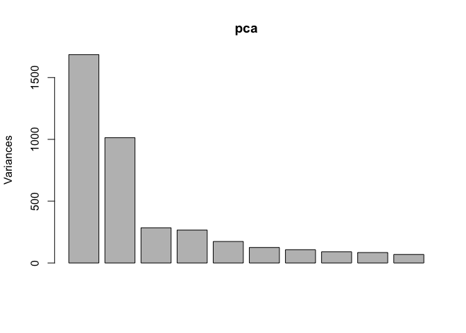<!-- -->

```r
# -- COPY - PASTE --
#dataframe with all PCs, their variance, and cumulative variance of all PCs
summary <- data.frame(PC = 1:126, var_explained = (pca$sdev)^2 / sum((pca$sdev)^2), 
                      cumulative = cumsum(pca$sdev^2 / sum(pca$sdev^2))
                      )
summary <- summary %>% 
  mutate(cumulative_perc = cumulative*100)

# -- --

#usually we only consider the first 30 PCs
summary <- summary[1:30,]

#different ways to represent the same data
summary %>%
  ggplot(aes(x = sort(as.factor(PC)), y = var_explained)) +
  geom_bar(stat = "identity", fill = "forest green") +
  # geom_text(aes(label = round(var_explained, digits = 2), vjust = -0.8), size = 2) +
  theme_minimal() +
  labs(title = "Variance Explained by each PC") 
```

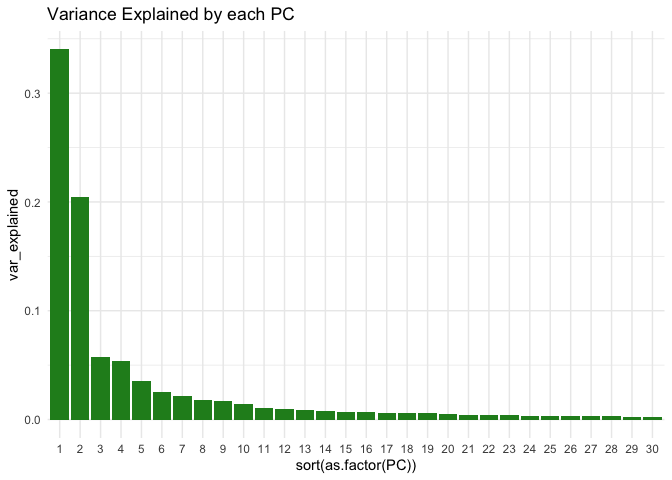<!-- -->

```r
summary %>%
  ggplot(aes(x = sort(as.factor(PC)), y = var_explained))+
  geom_point(colour = "forest green") +
  geom_line(group = "PC", colour = "forest green") +
  theme_minimal() +
  labs(title = "Variance Explained by each PC") 
```

<!-- -->

```r
summary %>%
  ggplot(aes(x = sort(as.factor(PC)), y = cumulative_perc))+
  geom_point(colour = "forest green") +
  geom_line(group = "PC", colour = "forest green") +
  theme_minimal() +
  labs(title = "Cumulative Proportion of Variation") 
```

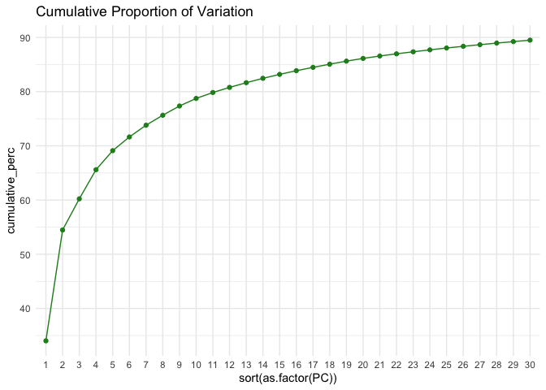<!-- -->

```r
#separating the PCA values into its won separate df
scores <- as.data.frame(pca$x)

scores <- scores[c(1:30)]
head(scores)
```

```
##           PC1        PC2        PC3        PC4        PC5        PC6        PC7
## C1  -2.873577  31.513465   4.581241 -34.747719  15.702070 -29.361896   8.508419
## C2   1.069681  21.246050 -10.968403   8.339987  -3.260639 -17.241597  -3.523015
## C3 -21.265732 -16.398176  11.405154 -49.406015 -10.698952  -6.128537  -1.064602
## C4   8.360660  48.599969   9.782527  12.568988   2.640562  -2.135567  -3.014367
## C5 -52.264090   7.886006   7.748767 -25.925634   9.453192  15.599042  -6.826804
## C6  13.613215  29.320890  -6.705883  15.198558  -7.176141   1.188698 -10.093523
##           PC8        PC9       PC10       PC11       PC12        PC13      PC14
## C1 -10.146967 -1.7393485   8.528270 -2.4318774  1.7644941  -5.1124617  1.642345
## C2  -3.660366 -0.8253942  -1.797925 -5.2304072 -0.7391959 -15.2686948 -2.139551
## C3  -5.071375 18.4334570  14.031947 -3.2970120 -6.8373987  -0.4272142  1.500038
## C4  -2.971492 -5.1869985   1.106609  0.6095576 -5.0401862  -6.4507389  2.681354
## C5   2.492451 -2.4695017 -19.801383 -5.0695824 -6.2003436  -2.4090045 11.883342
## C6  -3.208975  2.7844656  -6.127613 -1.0578476  0.4531912 -10.9567302  3.506287
##         PC15      PC16      PC17       PC18      PC19      PC20       PC21
## C1 -8.875898  9.958008 -2.257577  0.0760982 5.0013025 -3.701882  11.100054
## C2 -1.673642 -3.371377  3.338661 -4.5877960 4.8236714 -2.603036   4.839628
## C3  1.668607  8.304741 -5.059460  6.8785575 9.3845361  3.353635   5.716499
## C4 -9.781740  3.395398  2.955598  3.5514763 4.7594520  0.723566   2.178126
## C5  3.812600 10.180299 19.058720 -4.1820518 1.2522601  6.604281 -12.063440
## C6  1.709447 -2.951148  2.932438 -2.6384673 0.2379606 -2.517254   5.712442
##          PC22       PC23       PC24      PC25       PC26       PC27      PC28
## C1 -1.1830862 -4.3701516 -6.0269453  2.487731 -3.9176775  7.2084391 -1.931781
## C2 -0.1437366 -4.0622984  0.6567662  1.469711 -3.0097441  1.4143064 -1.387003
## C3  7.6056574  1.1696635 -1.0229573  1.078533  1.9816533 -0.2157957  1.227088
## C4 -5.2577541  8.6100230  1.0761861 -0.495693  0.2191656 -0.8076055  2.522992
## C5  4.2031459  4.3432118  3.7112434  3.547634  3.0213863  4.0804927 -4.757769
## C6  2.2821878 -0.9523062 -1.6960234  2.700263  3.7529861  2.8236221 -2.476955
##          PC29        PC30
## C1  7.1364450 -1.27354936
## C2 -2.0213152 -1.19972570
## C3  7.3628155 12.38335042
## C4 -3.9418235 -0.03496177
## C5  0.7855329  0.31440811
## C6  0.1467464  0.12057683
```

```r
#making a metadata df containing all sample information data
mDat <- cbind(pDat, scores)
```

Now that we have our PC scores, we'll estimate which of our variables are the ones driving that variation in our data 


```r
# install.packages("remotes")
# library(remotes)
# remotes::install_github("wvictor14/plomics")
library(plomics)

#here, we'll select the Pvalue metric
variable_variance <- lmmatrix(dep = scores, ind = pDat[c(2:15)], metric = "Pvalue")

head(variable_variance)
```

```
##                         PC1          PC2          PC3          PC4         PC5
## Age            4.433720e-01 1.024292e-03 5.357586e-01 0.1227241839 0.530243367
## Sex            2.270582e-01 2.730491e-01 4.905150e-01 0.9222153751 0.985665262
## COVID          3.356380e-04 3.558523e-03 3.231238e-11 0.2342246582 0.005592154
## ICU            8.607671e-04 1.152275e-10 1.203749e-01 0.0004498275 0.761884831
## APACHEII_Score 9.648283e-06 4.796524e-11 6.234301e-03 0.0039225543 0.022536445
## Charlson_Score 4.551605e-01 1.596603e-03 3.119950e-01 0.4360322298 0.847497524
##                        PC6        PC7       PC8        PC9      PC10       PC11
## Age            0.003551443 0.04887319 0.9698820 0.08404132 0.4838427 0.14276659
## Sex            0.924984016 0.74093414 0.6743761 0.53969685 0.5688295 0.21571274
## COVID          0.765978287 0.02029783 0.1465711 0.82483687 0.5066316 0.83510449
## ICU            0.698404893 0.19821494 0.6957646 0.92452028 0.9779782 0.50625488
## APACHEII_Score 0.456567963 0.51758869 0.2700249 0.37744914 0.6434340 0.47439984
## Charlson_Score 0.249114900 0.10373783 0.3765287 0.69639356 0.3802474 0.02343673
##                      PC12       PC13      PC14      PC15       PC16      PC17
## Age            0.88361422 0.29556981 0.1560049 0.6758504 0.94884057 0.6832243
## Sex            0.12288159 0.17095735 0.2707008 0.7513489 0.08798836 0.3760878
## COVID          0.28871134 0.36779251 0.8489379 0.2753187 0.89386734 0.4998182
## ICU            0.08508769 0.07605797 0.4620665 0.3548583 0.90081795 0.1395691
## APACHEII_Score 0.47503481 0.03731661 0.6887634 0.6241562 0.96863246 0.3662505
## Charlson_Score 0.06465515 0.17139990 0.8719106 0.5129812 0.90253659 0.5135770
##                      PC18        PC19      PC20       PC21      PC22      PC23
## Age            0.88442521 0.005217742 0.9607615 0.37280299 0.5185930 0.3420459
## Sex            0.43156896 0.142272226 0.4658982 0.35591767 0.7702244 0.5003367
## COVID          0.25625700 0.532989041 0.3405511 0.02320487 0.6135451 0.3112817
## ICU            0.01080291 0.583716805 0.7760423 0.79522088 0.3668543 0.2460771
## APACHEII_Score 0.09355615 0.961482917 0.7125361 0.95046979 0.9949991 0.9708908
## Charlson_Score 0.43556492 0.269060667 0.4242116 0.07719944 0.3677115 0.1525067
##                      PC24       PC25       PC26      PC27       PC28
## Age            0.23333502 0.52453069 0.71000558 0.5339782 0.45641686
## Sex            0.92204393 0.57985293 0.01979339 0.3029324 0.02703745
## COVID          0.51166564 0.38139380 0.79538660 0.3603583 0.81197760
## ICU            0.06641195 0.90489350 0.88716159 0.5934191 0.73924939
## APACHEII_Score 0.15238958 0.53764391 0.66193829 0.8974279 0.50100394
## Charlson_Score 0.11556830 0.09411374 0.38307618 0.2623510 0.02145716
##                        PC29      PC30
## Age            0.0001336431 0.1245905
## Sex            0.1733599130 0.9956886
## COVID          0.8094699294 0.7442335
## ICU            0.5637311577 0.7969355
## APACHEII_Score 0.3283939438 0.4591115
## Charlson_Score 0.0298356039 0.7890196
```

```r
vv_plot <- variable_variance %>% 
  as.data.frame() 
vv_plot <- as.data.frame(t(vv_plot))
vv_plot <- vv_plot %>% 
  mutate(Principle_Component = 1:30) %>% 
  dplyr::select(Principle_Component, everything())
head(vv_plot)
```

```
##     Principle_Component         Age       Sex        COVID          ICU
## PC1                   1 0.443372048 0.2270582 3.356380e-04 8.607671e-04
## PC2                   2 0.001024292 0.2730491 3.558523e-03 1.152275e-10
## PC3                   3 0.535758592 0.4905150 3.231238e-11 1.203749e-01
## PC4                   4 0.122724184 0.9222154 2.342247e-01 4.498275e-04
## PC5                   5 0.530243367 0.9856653 5.592154e-03 7.618848e-01
## PC6                   6 0.003551443 0.9249840 7.659783e-01 6.984049e-01
##     APACHEII_Score Charlson_Score Mechanical_Ventilation Ventilator_free_days
## PC1   9.648283e-06    0.455160547           2.035603e-07         5.407286e-03
## PC2   4.796524e-11    0.001596603           3.001057e-06         6.660971e-05
## PC3   6.234301e-03    0.311995034           3.438765e-02         1.140585e-04
## PC4   3.922554e-03    0.436032230           1.228092e-02         4.958919e-01
## PC5   2.253645e-02    0.847497524           2.315671e-01         1.297751e-01
## PC6   4.565680e-01    0.249114900           2.960095e-01         3.598802e-01
##     Hospital_free_days_post_45_days Ferritin_ng.ml     CRP_mg.l
## PC1                    2.161055e-03   5.641500e-02 0.0013990643
## PC2                    9.070318e-09   3.268577e-01 0.0870827222
## PC3                    1.276553e-06   7.301131e-06 0.0000294515
## PC4                    3.399023e-01   5.905019e-01 0.7613512673
## PC5                    3.001829e-01   8.238546e-01 0.7530516400
## PC6                    1.702699e-01   7.176295e-01 0.8095881925
##     Procalcitonin_ng.ml Lactate_mmol.l Fibrinogen_mg.dL
## PC1         0.466435480    0.359643697      0.084735902
## PC2         0.407907372    0.006193814      0.900148170
## PC3         0.029758491    0.095157140      0.002538692
## PC4         0.410411302    0.286958286      0.818851094
## PC5         0.008701715    0.821823536      0.336487280
## PC6         0.665651463    0.432498676      0.149312722
```

```r
vv_plot <- vv_plot %>% 
  pivot_longer(cols = -c(Principle_Component), names_to = "variables", values_to = "pval") 
vv_plot <- vv_plot %>% 
  mutate(pval_cat = case_when(
    pval > 0.05  ~ "> 0.05",
    pval < 0.05 & pval > 0.01 ~ "< 0.05",
    pval < 0.01 & pval > 0.001 ~ "< 0.01",
    pval < 0.001 ~ "< 0.001"
  ))

vv_plot %>% 
  ggplot(aes(x = Principle_Component, y = variables, fill = pval_cat)) +
  geom_tile() + 
  theme_bw() +
  labs(x = "PC", y = "Variables" , fill = "P value")
```

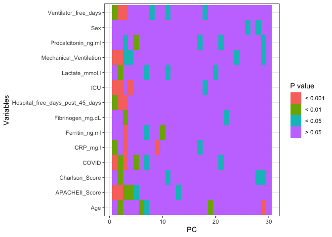<!-- -->

```r
vv_colpal <- c("< 0.001" = "#ef6a4c", "< 0.01" = "#f59e72", "< 0.05" = "#fde0c5", "> 0.05" = "white")
vv_plot$Principle_Component <- as.factor(vv_plot$Principle_Component)

g3 <- vv_plot %>% 
  ggplot(aes(x = Principle_Component, y = variables, fill = pval_cat)) +
  geom_tile(col = "lightgrey") + 
  theme_bw() +
  scale_x_discrete(expand = c(0, 0)) +
  scale_y_discrete(expand = c(0, 0)) +
  scale_fill_manual(values = vv_colpal) +
  coord_fixed() + 
  # theme(legend.position = "bottom") +
  labs(x = "PC", y = "Variables" , fill = "P value")

# ASSIGNMENT 1: Repeat the lmmatrix function, but this time with using the Rsqaured value. Store it as a separate variable, and plot both the pval and rsquared plots one below each other. 
# Instead of using `scale_fill_manual` for the plot, use `scale_fill_gradient(low = "", high = "#")` 

rsq <- lmmatrix(dep = scores, ind = pDat[c(2:15)], metric = "Rsquared")

rsq <- rsq %>% 
  as.data.frame() 

rsq <- as.data.frame(t(rsq))

rsq <- rsq %>% 
  mutate(Principle_Component = 1:30) %>% 
  dplyr::select(Principle_Component, everything())

head(rsq)
```

```
##     Principle_Component         Age          Sex       COVID          ICU
## PC1                   1 0.004746062 0.0238182452 0.098889121 0.0859946047
## PC2                   2 0.083606593 0.0208861737 0.066481503 0.2856273580
## PC3                   3 0.003100076 0.0115152891 0.299867096 0.0193440583
## PC4                   4 0.019103990 0.0013158244 0.011392135 0.0948872854
## PC5                   5 0.003184566 0.0002347444 0.060269454 0.0007431426
## PC6                   6 0.066508892 0.0012671448 0.000717059 0.0012149315
##     APACHEII_Score Charlson_Score Mechanical_Ventilation Ventilator_free_days
## PC1     0.14660374   0.0045061211             0.19635489          0.060731067
## PC2     0.29547182   0.0775061355             0.16191424          0.120830111
## PC3     0.05877739   0.0082427650             0.03558802          0.113565869
## PC4     0.06514221   0.0049004727             0.04949967          0.003747719
## PC5     0.04126041   0.0002994187             0.01152171          0.018412669
## PC6     0.00447812   0.0106973907             0.00880372          0.006764889
##     Hospital_free_days_post_45_days Ferritin_ng.ml     CRP_mg.l
## PC1                     0.073342365   0.0290411798 0.0793220901
## PC2                     0.234656728   0.0077535666 0.0234252650
## PC3                     0.172984201   0.1502774278 0.1317808459
## PC4                     0.007347690   0.0023418570 0.0007465799
## PC5                     0.008653592   0.0004011011 0.0008011664
## PC6                     0.015111705   0.0010583402 0.0004700105
##     Procalcitonin_ng.ml Lactate_mmol.l Fibrinogen_mg.dL
## PC1         0.004285549   0.0067715297     0.0237743019
## PC2         0.005530277   0.0588667977     0.0001274707
## PC3         0.037521591   0.0222970352     0.0711267185
## PC4         0.005471633   0.0091387516     0.0004246148
## PC5         0.054207104   0.0004105611     0.0074519270
## PC6         0.001510836   0.0049762262     0.0166949341
```

```r
rsq <- rsq %>% 
  pivot_longer(cols = -c(Principle_Component), names_to = "variables", values_to = "rsq") 

rsq$Principle_Component <- as.factor(rsq$Principle_Component)

str(rsq)
```

```
## tibble [420 × 3] (S3: tbl_df/tbl/data.frame)
##  $ Principle_Component: Factor w/ 30 levels "1","2","3","4",..: 1 1 1 1 1 1 1 1 1 1 ...
##  $ variables          : chr [1:420] "Age" "Sex" "COVID" "ICU" ...
##  $ rsq                : num [1:420] 0.00475 0.02382 0.09889 0.08599 0.1466 ...
```

```r
g4 <- rsq %>% 
  ggplot(aes(x = Principle_Component, y = variables, fill = rsq)) +
  geom_tile(col = "lightgrey") + 
  theme_bw() +
  scale_x_discrete(expand = c(0, 0)) +
  scale_y_discrete(expand = c(0, 0)) +
  scale_fill_gradient(low = "white", high = "#ef6a4c") +
  coord_fixed() + 
  # theme(legend.position = "bottom") +
  labs(x = "PC", y = "Variables" , fill = "R-square")

ggarrange(g3, g4, ncol = 1, nrow = 2)
```

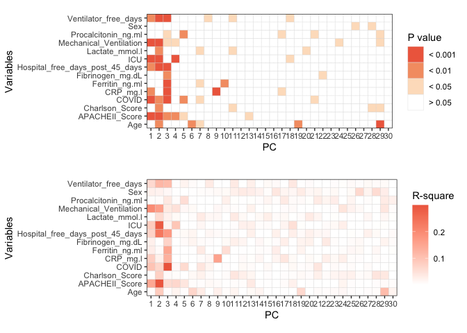<!-- -->

We'll now plot the first 2 PCs with the variables that seem to be contributing to the most variance in the data.


```r
mDat %>% 
  ggplot(aes(x = PC1, y = PC2, colour = COVID)) +
  geom_point(size = 3) +
  # coord_cartesian(ylim = c(-130, 130), xlim = c(-130, 130)) +
  labs( x = "Principle Component 1", y = "Principle Component 2", title = "COVID: PC1 vs PC2") +
  scale_colour_manual(values = c("orange", "gray")) +
  theme_minimal() 
```

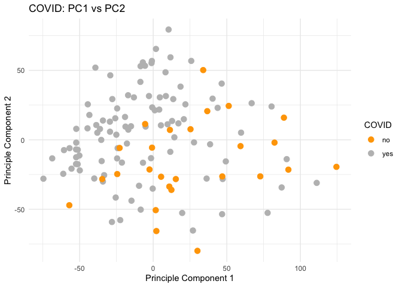<!-- -->

```r
mDat %>% 
  ggplot(aes(x = PC1, y = PC2, colour = ICU)) +
  geom_point(size = 3) +
  coord_cartesian(ylim = c(-130, 130), xlim = c(-130, 130)) +
  labs( x = "Principle Component 1", y = "Principle Component 2", title = "ICU: PC1 vs PC2") +
  scale_colour_manual(values = c("grey", "blue")) +
  theme_minimal() 
```

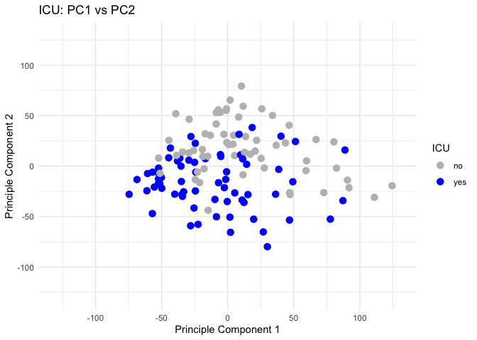<!-- -->

```r
mDat %>% 
  ggplot(aes(x = PC1, y = PC2, colour = Mechanical_Ventilation)) +
  geom_point(size = 3) +
  coord_cartesian(ylim = c(-130, 130), xlim = c(-130, 130)) +
  labs( x = "Principle Component 1", y = "Principle Component 2", title = "Mechanical Ventilation: PC1 vs PC2") +
  scale_colour_manual(values = c("grey", "purple")) +
  theme_minimal()
```

<!-- -->

```r
mDat %>% 
  # mutate(AP_score = case_when(
  #   APACHEII_Score <= 10 ~ "less_than_10",
  #   between(APACHEII_Score, 11, 20) ~ "eleven_to_20",
  #   between(APACHEII_Score, 21, 30) ~ "twentyone_to_30",
  #   between(APACHEII_Score, 31, 40) ~ "thirtyone_to_40",
  #   APACHEII_Score > 40 ~ "more_than_40")) %>% 
  ggplot(aes(x = PC1, y = PC2, colour = APACHEII_Score)) +
  geom_point(size = 3) +
  coord_cartesian(ylim = c(-130, 130), xlim = c(-130, 130)) +
  labs( x = "Principle Component 1", y = "Principle Component 2", title = "APACHEII_Score", subtitle = "Score of disease-severity measured upon admittance to ICU") +
  theme_minimal() 
```

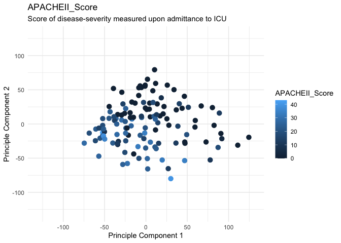<!-- -->

```r
#EXTRA - COMPARE PC2 and PC3
#PC2-3

mDat %>% 
  ggplot(aes(x = PC2, y = PC3, colour = Ventilator_free_days)) +
  geom_point(size = 3) +
  coord_cartesian(ylim = c(-100, 100), xlim = c(-100, 100)) +
  labs( x = "Principle Component 2", y = "Principle Component 3", title = "Ventilator Free Days : PC1 vs PC2") +
  #scale_colour_manual(values = c("grey", "purple")) +
  theme_minimal()
```

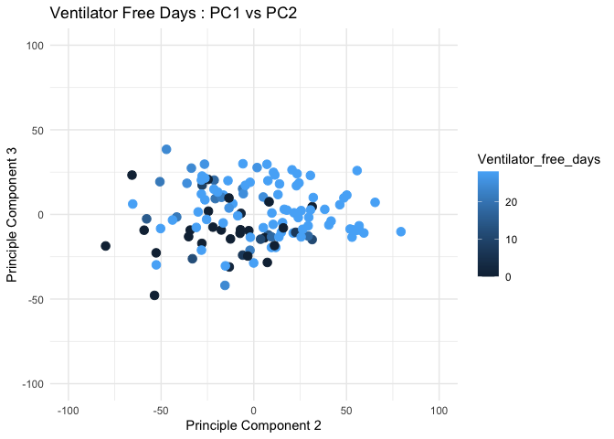<!-- -->

```r
mDat %>% 
  ggplot(aes(x = PC2, y = PC3, colour = ICU)) +
  geom_point(size = 3) +
  coord_cartesian(ylim = c(-100, 100), xlim = c(-100, 100)) +
  labs( x = "Principle Component 2", y = "Principle Component 3", title = "ICU: PC1 vs PC2") +
  scale_colour_manual(values = c("grey", "blue")) +
  theme_minimal() 
```

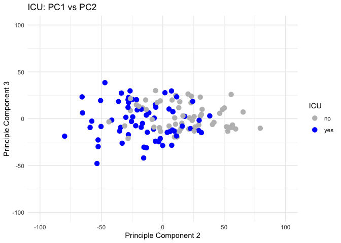<!-- -->

### 7.0 Differential Expression Analysis  

Okay, now moving into DE analysis: we're going to use the limma package, rather than the more popular DESeq2 or edgeR packages. There's broadly 3 steps to pulling out DE genes:  

1. Specifying your variables of interest to generate a model in the form of a matrix    
2. Fitting our data to that model
3. Applying Bayesian statistics to the results of our model


```r
library(limma)

mm_covid <- model.matrix(~COVID, pDat) 
#always better to use an intercept, as the starting value is not forced to zero

head(mm_covid)
```

```
##    (Intercept) COVIDyes
## C1           1        1
## C2           1        1
## C3           1        1
## C4           1        1
## C5           1        1
## C6           1        1
```

```r
all(rownames(pDat) == colnames(eNorm))
```

```
## [1] TRUE
```

```r
efit_COVID <- lmFit(eNorm, mm_covid)

efit_COVID <- efit_COVID %>% 
  eBayes()

#"BH", "BY" and "holm"
topTable(efit_COVID, coef = "COVIDyes", adjust.method = "fdr", p.value = 0.05)
```

```
##                logFC    AveExpr         t      P.Value    adj.P.Val        B
## GBGT1     -14.346965  13.119938 -8.608852 2.704926e-14 3.208042e-10 21.74699
## MCM6       13.006445  20.821294  8.119125 3.863965e-13 1.759204e-09 19.24480
## SLC12A9   -95.036340 100.648629 -8.092907 4.449926e-13 1.759204e-09 19.11189
## SLC15A3   -59.232204  68.814556 -7.998129 7.405414e-13 2.195705e-09 18.63245
## MAPK8IP3  -18.433847  29.398845 -7.874219 1.437384e-12 3.409474e-09 18.00811
## CDC7        3.365151   5.656738  7.711515 3.417089e-12 6.754446e-09 17.19281
## AIF1     -323.686454 472.519567 -7.566778 7.346232e-12 1.244662e-08 16.47216
## CLSPN       2.952676   4.133007  7.437656 1.448122e-11 2.146841e-08 15.83317
## PITPNM1   -16.397367  24.699942 -7.409046 1.682170e-11 2.216727e-08 15.69211
## TWF2      -84.289346 100.564424 -7.327147 2.580083e-11 3.059979e-08 15.28940
```

```r
topTable(efit_COVID, coef = "COVIDyes", adjust.method = "fdr", p.value = 0.05)
```

```
##                logFC    AveExpr         t      P.Value    adj.P.Val        B
## GBGT1     -14.346965  13.119938 -8.608852 2.704926e-14 3.208042e-10 21.74699
## MCM6       13.006445  20.821294  8.119125 3.863965e-13 1.759204e-09 19.24480
## SLC12A9   -95.036340 100.648629 -8.092907 4.449926e-13 1.759204e-09 19.11189
## SLC15A3   -59.232204  68.814556 -7.998129 7.405414e-13 2.195705e-09 18.63245
## MAPK8IP3  -18.433847  29.398845 -7.874219 1.437384e-12 3.409474e-09 18.00811
## CDC7        3.365151   5.656738  7.711515 3.417089e-12 6.754446e-09 17.19281
## AIF1     -323.686454 472.519567 -7.566778 7.346232e-12 1.244662e-08 16.47216
## CLSPN       2.952676   4.133007  7.437656 1.448122e-11 2.146841e-08 15.83317
## PITPNM1   -16.397367  24.699942 -7.409046 1.682170e-11 2.216727e-08 15.69211
## TWF2      -84.289346 100.564424 -7.327147 2.580083e-11 3.059979e-08 15.28940
```

```r
topTable(efit_COVID, coef = "COVIDyes", adjust.method = "fdr", p.value = 0.05, sort.by = "p")
```

```
##                logFC    AveExpr         t      P.Value    adj.P.Val        B
## GBGT1     -14.346965  13.119938 -8.608852 2.704926e-14 3.208042e-10 21.74699
## MCM6       13.006445  20.821294  8.119125 3.863965e-13 1.759204e-09 19.24480
## SLC12A9   -95.036340 100.648629 -8.092907 4.449926e-13 1.759204e-09 19.11189
## SLC15A3   -59.232204  68.814556 -7.998129 7.405414e-13 2.195705e-09 18.63245
## MAPK8IP3  -18.433847  29.398845 -7.874219 1.437384e-12 3.409474e-09 18.00811
## CDC7        3.365151   5.656738  7.711515 3.417089e-12 6.754446e-09 17.19281
## AIF1     -323.686454 472.519567 -7.566778 7.346232e-12 1.244662e-08 16.47216
## CLSPN       2.952676   4.133007  7.437656 1.448122e-11 2.146841e-08 15.83317
## PITPNM1   -16.397367  24.699942 -7.409046 1.682170e-11 2.216727e-08 15.69211
## TWF2      -84.289346 100.564424 -7.327147 2.580083e-11 3.059979e-08 15.28940
```

```r
topTable(efit_COVID, coef = "COVIDyes", adjust.method = "fdr", p.value = 0.05, sort.by = "logFC")
```

```
##               logFC   AveExpr         t      P.Value    adj.P.Val           B
## S100A9   -10554.113 22372.842 -2.567381 1.142823e-02 2.912609e-02 -3.14921169
## HBA2      -4627.381  2670.516 -5.072714 1.385177e-06 3.487942e-05  5.06699674
## ACTB      -4416.516  7242.785 -6.023213 1.782930e-08 1.639190e-06  9.14052918
## FTL       -4187.909  6897.358 -5.544648 1.679337e-07 7.572980e-06  7.03827981
## IFITM2    -2848.844  5357.986 -3.659910 3.710775e-04 1.980639e-03 -0.09398016
## RNA28SN1  -2740.657  2785.014 -5.705683 7.982667e-08 4.733722e-06  7.73475274
## RNA28SN4  -2351.735  1437.686 -7.147384 6.556764e-11 4.860201e-08 14.41135701
## EEF1A1    -2146.417  8071.037 -3.468840 7.182910e-04 3.236676e-03 -0.69295220
## FCGR3B     2140.546  6069.773  2.383893 1.863926e-02 4.307319e-02 -3.56958200
## HBA1      -2103.973  1667.291 -3.847665 1.893569e-04 1.225359e-03  0.51944745
```

```r
#google S100A9, GBGT1, and COVID - what do we find?
```

We know from our PCA that age doesn't seem to contribute to the variation observed. Let's check whether controlling for age in our model changes the results we obtained  


```r
mm_age <- model.matrix(~COVID + Age, pDat)

#We'll first, however, get some statistics on the quality of our model with including age
mm_age <- as.data.frame(mm_age)

#logistic requires categorical to be either yes or no
model1 <- glm(COVIDyes ~ Age, data = mm_age, family = binomial)
summary(model1)
```

```
## 
## Call:
## glm(formula = COVIDyes ~ Age, family = binomial, data = mm_age)
## 
## Deviance Residuals: 
##     Min       1Q   Median       3Q      Max  
## -1.9352   0.5739   0.6543   0.7122   0.7818  
## 
## Coefficients:
##             Estimate Std. Error z value Pr(>|z|)  
## (Intercept)  2.08533    0.88314   2.361   0.0182 *
## Age         -0.01187    0.01353  -0.877   0.3804  
## ---
## Signif. codes:  0 '***' 0.001 '**' 0.01 '*' 0.05 '.' 0.1 ' ' 1
## 
## (Dispersion parameter for binomial family taken to be 1)
## 
##     Null deviance: 128.29  on 125  degrees of freedom
## Residual deviance: 127.49  on 124  degrees of freedom
## AIC: 131.49
## 
## Number of Fisher Scoring iterations: 4
```

```r
#Here the summary shows that age does not seem to strongly correlate with COVID status, and so hence we would not expect a major change in our results on including it in our model (and so hence, we should not). However, just to test that, let's add it to out model and check the resutls.

mm_age <- model.matrix(~COVID + Age, pDat) 

efit_age <- lmFit(eNorm, mm_age) %>% 
  eBayes()

topTable(efit_age, coef = "COVIDyes", adjust.method = "fdr", p.value = 0.05, sort.by = "logFC")
```

```
##               logFC   AveExpr         t      P.Value    adj.P.Val          B
## S100A9   -10160.956 22372.842 -2.468919 1.491768e-02 3.595278e-02 -3.3784598
## HBA2      -4648.774  2670.516 -5.061858 1.465260e-06 3.794319e-05  5.0153718
## ACTB      -4316.973  7242.785 -5.916899 3.003894e-08 2.698953e-06  8.6518054
## FTL       -4089.673  6897.358 -5.436198 2.784468e-07 1.182517e-05  6.5659556
## RNA28SN1  -2764.601  2785.014 -5.723978 7.430527e-08 5.123607e-06  7.8026755
## IFITM2    -2700.867  5357.986 -3.528938 5.866230e-04 2.833951e-03 -0.5090658
## RNA28SN4  -2357.059  1437.686 -7.114010 8.004557e-11 6.328936e-08 14.2240520
## EEF1A1    -2349.765  8071.037 -4.066164 8.445041e-05 6.874275e-04  1.2600294
## FCGR3B     2193.313  6069.773  2.430801 1.650034e-02 3.894029e-02 -3.4649414
## HBA1      -2114.040  1667.291 -3.839525 1.957299e-04 1.271976e-03  0.4898601
```

```r
topTable(efit_age, coef = "COVIDyes", adjust.method = "fdr", p.value = 0.05, sort.by = "p")
```

```
##                logFC    AveExpr         t      P.Value    adj.P.Val        B
## GBGT1     -14.046860  13.119938 -8.550910 3.893914e-14 4.618182e-10 21.40403
## MCM6       12.757246  20.821294  8.034319 6.344663e-13 3.003183e-09 18.77807
## SLC12A9   -93.350898 100.648629 -8.000681 7.596584e-13 3.003183e-09 18.60857
## SLC15A3   -58.215586  68.814556 -7.902345 1.284422e-12 3.808311e-09 18.11420
## MAPK8IP3  -18.489458  29.398845 -7.844907 1.743990e-12 4.136744e-09 17.82627
## CDC7        3.324990   5.656738  7.608243 6.104652e-12 1.206686e-08 16.64678
## AIF1     -321.225164 472.519567 -7.472091 1.247953e-11 2.114389e-08 15.97360
## PITPNM1   -16.437456  24.699942 -7.376130 2.060166e-11 2.972291e-08 15.50168
## TTC9      -24.915019  19.432974 -7.350907 2.349422e-11 2.972291e-08 15.37799
## CLSPN       2.923208   4.133007  7.338497 2.506148e-11 2.972291e-08 15.31720
```

```r
#We see that when arranged by logFC and by adjusted pvalue our model with and without age shows the same ordering of the genes.
#
```

We saw that lactate concentration was contributing to PC2. Let's check if we should be adjusting for this variable. 


```r
mm_lactate <- model.matrix(~COVID + Age + Lactate_mmol.l , pDat) 

mm_lactate_df <- as.data.frame(mm_lactate) 

lactate_logres <- glm(COVIDyes ~ Lactate_mmol.l, data = mm_lactate_df, family = binomial)
summary(lactate_logres)
```

```
## 
## Call:
## glm(formula = COVIDyes ~ Lactate_mmol.l, family = binomial, data = mm_lactate_df)
## 
## Deviance Residuals: 
##     Min       1Q   Median       3Q      Max  
## -2.1839   0.4396   0.4876   0.6916   1.3768  
## 
## Coefficients:
##                Estimate Std. Error z value Pr(>|z|)    
## (Intercept)      2.2880     0.3943   5.803  6.5e-09 ***
## Lactate_mmol.l  -0.8370     0.2641  -3.170  0.00153 ** 
## ---
## Signif. codes:  0 '***' 0.001 '**' 0.01 '*' 0.05 '.' 0.1 ' ' 1
## 
## (Dispersion parameter for binomial family taken to be 1)
## 
##     Null deviance: 128.29  on 125  degrees of freedom
## Residual deviance: 114.03  on 124  degrees of freedom
## AIC: 118.03
## 
## Number of Fisher Scoring iterations: 5
```

```r
#The summary shows that lactate conc indeed does seem to be significantly associated with COVID status. Let's visualise that
mm_lactate_df %>%
  ggplot(aes(x = Lactate_mmol.l, y = COVIDyes)) +
  geom_point(alpha = 0.2, colour = "orange") +
  geom_smooth(method = "glm", method.args = list(family = "binomial"), colour = "orange") +
  theme_minimal() +
  labs(title = "Does lactate concentration inform of COVID status?", x = "Lactate (mmol/l)", y = "Probability of COVID-positive status")
```

```
## `geom_smooth()` using formula 'y ~ x'
```

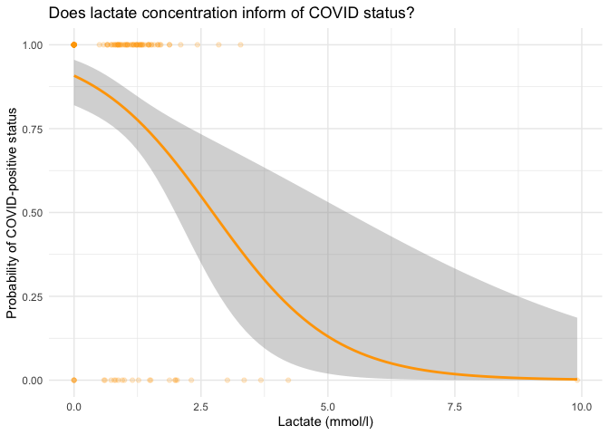<!-- -->

```r
#so now we know that there is a significant association with lactate levels and the probability of having COVID. Let's add lactate to our linear model
efit_lactate <- lmFit(eNorm, mm_lactate) %>% 
  eBayes()

topTable(efit_lactate, coef = "COVIDyes", adjust.method = "fdr", p.value = 0.05, sort.by = "logFC")
```

```
##              logFC   AveExpr         t      P.Value    adj.P.Val         B
## HBA2     -5210.007  2670.516 -5.385548 3.539048e-07 1.345292e-05  6.340548
## FTL      -4311.149  6897.358 -5.390220 3.465486e-07 1.330119e-05  6.360120
## ACTB     -4282.144  7242.785 -5.505742 2.054988e-07 9.671785e-06  6.847267
## B2M       3412.417 16010.351  2.456013 1.544921e-02 3.429982e-02 -3.380356
## RNA28SN1 -3159.340  2785.014 -6.270212 5.604685e-09 9.535513e-07 10.213496
## EEF1A1   -2693.280  8071.037 -4.421591 2.132161e-05 2.241793e-04  2.539581
## TXNIP     2553.288  6352.420  2.633243 9.545841e-03 2.326149e-02 -2.965630
## FCGR3B    2515.155  6069.773  2.625327 9.758295e-03 2.365285e-02 -2.984703
## RNA28SN4 -2484.467  1437.686 -7.066989 1.047085e-10 7.304959e-08 13.943124
## HBA1     -2333.695  1667.291 -3.995972 1.103875e-04 7.395894e-04  1.029708
```

```r
topTable(efit_lactate, coef = "COVIDyes", adjust.method = "fdr", p.value = 0.05, sort.by = "p")
```

```
##                 logFC     AveExpr         t      P.Value    adj.P.Val        B
## GBGT1      -13.963579   13.119938 -7.973972 9.113518e-13 1.080863e-08 18.39146
## MCM6        13.144090   20.821294  7.779510 2.559992e-12 1.518075e-08 17.42315
## PELI3       -3.815512    4.537970 -7.608310 6.313696e-12 2.006979e-08 16.57670
## CDC7         3.508467    5.656738  7.573188 7.592156e-12 2.006979e-08 16.40379
## MAPK8IP3   -18.953293   29.398845 -7.552521 8.461124e-12 2.006979e-08 16.30217
## SLC15A3    -58.752574   68.814556 -7.482132 1.222926e-11 2.417318e-08 15.95675
## HAAO        -3.876829    3.365732 -7.408312 1.797297e-11 3.045134e-08 15.59568
## NAPSA      -29.218496   24.012864 -7.379814 2.084582e-11 3.090392e-08 15.45663
## METRNL     -18.059601   15.634706 -7.343845 2.512911e-11 3.311459e-08 15.28138
## RNA18SN2 -1936.116600 1965.367916 -7.282163 3.459589e-11 3.419227e-08 14.98158
```

```r
# ASSIGNMENT 2: calculate if any 2 variables of your choice might have a correlation with COVID status by using the geom_smooth argument in ggplot

pDat %>% 
  mutate(covid = case_when(
    COVID == "yes" ~ 1,
    COVID == "no" ~ 0)) %>% 
  ggplot(aes(x = CRP_mg.l, y = covid)) +
  geom_point(alpha = 0.2, colour = "orange") +
  geom_smooth(method = "glm", method.args = list(family = "binomial"), colour = "orange") +
  theme_minimal() +
  labs(title = "Does CRP concentration inform of COVID status?", x = "Lactate (mmol/l)", y = "Probability of COVID-positive status")
```

```
## `geom_smooth()` using formula 'y ~ x'
```

<!-- -->

Given that we saw that the S100A9 gene showed the highest negative logFC in our first model, let's compare the expression of S100A9 between COVID positive and negative patients.  


```r
S100A9 <- eNorm %>% 
  rownames_to_column(var = "gene") %>% 
  filter(gene == "S100A9") %>% 
  column_to_rownames(var = "gene")
  
S100A9 <- as.data.frame(t(S100A9))

S100A9 <- S100A9 %>% 
  rownames_to_column(var = "sample")

pDat <- pDat %>% 
  rownames_to_column(var = "sample")

covid <- pDat %>% 
  dplyr::select(sample, COVID)
  
S100A9 <- S100A9 %>% 
  left_join(covid, by = "sample")

S100A9 %>% 
  ggplot(aes(x = COVID, y = log2(S100A9), fill = COVID)) +
  geom_boxplot() +
  scale_fill_manual(values = c("gray", "orange")) +
  theme_minimal() + 
  theme(legend.position = "bottom") +
  labs(x = "COVID Status", y = "log2 (S100A9 RPM)", title = "S100A9: Gene with highest negative logFC change")
```

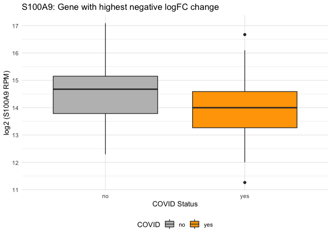<!-- -->

```r
#The difference doesn't seem much because S100A9 was pulled out from a very simple model where we only included COVID status as a variable.
```


```r
# GBGT1 <- eNorm %>% 
#   rownames_to_column(var = "gene") %>% 
#   filter(gene == "GBGT1") %>% 
#   column_to_rownames(var = "gene")
#   
# GBGT1 <- as.data.frame(t(GBGT1))
# 
# GBGT1 <- GBGT1 %>% 
#   rownames_to_column(var = "sample")
#   
# GBGT1 <- GBGT1 %>% 
#   left_join(covid, by = "sample")
# 
# GBGT1 %>% 
#   ggplot(aes(x = COVID, y = log2(GBGT1), fill = COVID)) +
#   geom_violin() +
#   scale_fill_manual(values = c("gray", "orange")) +
#   theme_minimal() + 
#   theme(legend.position = "bottom") +
#   labs(x = "COVID Status", y = "log2 (GBGT1 RPM)", title = "GBGT1: Gene with lowest adjusted p-value with or without accounting for lactate")
# 


#ASSIGNMENT 3: do the same plots for HBA2 but use geom_violin to visualize expression and facet_wrap to separate by COVID status

HBA2 <- eNorm %>% 
  rownames_to_column(var = "gene") %>% 
  filter(gene == "HBA2") %>% 
  column_to_rownames(var = "gene")
  
HBA2 <- as.data.frame(t(HBA2))

HBA2 <- HBA2 %>% 
  rownames_to_column(var = "sample")
  
HBA2 <- HBA2 %>% 
  left_join(covid, by = "sample")

HBA2 %>% 
  ggplot(aes(x = COVID, y = log2(HBA2), fill = COVID)) +
  geom_violin() +
  geom_dotplot(binaxis = "y", stackdir = "center", dotsize = 0.7, fill = "black") +
  scale_fill_manual(values = c("gray", "orange")) +
  theme_minimal() + 
  theme(legend.position = "bottom") +
  labs(x = "COVID Status", y = "log2 (HBA2 RPM)", title = "HBA2: Gene with highest negative logFC change on including lactate concentration in the model")
```

```
## Bin width defaults to 1/30 of the range of the data. Pick better value with `binwidth`.
```

<!-- -->

```r
# HBA2 %>% 
#   ggplot(aes(x = sample, y = log2(HBA2), colour = COVID)) +
#   geom_point() +
#   scale_colour_manual(values = c("gray", "orange")) +
#   theme_minimal() + 
#   theme(legend.position = "bottom") +
#   labs(x = "COVID Status", y = "log2 (HBA2 RPM)", title = "HBA2: Gene with highest negative logFC change on including lactate concentration in the model") +
#   facet_grid(~COVID)
```

In case of wanting to measure the differences in the expression between timepoints, we'll use a function called as `makeContrasts` We're make a dummy protein to work through the process:


```r
## -- COPY - PASTE ---

set.seed(500)

#we'll call this dummy protein `unicorn`

unicorn_COVID <- pDat %>% 
  filter(COVID == "yes") %>% 
  dplyr::select(sample, COVID)

#specifying number of obvs, mean, and sd
unicorn_COVID <- unicorn_COVID %>% 
  mutate(unicorn_0days = rnorm(n = 100, mean = 1000, sd = 20), 
         unicorn_7days = rnorm(n = 100, mean = 500, sd = 20), 
         unicorn_14days = rnorm(n = 100, mean = 100, sd = 20))

unicorn_nonCOVID <- pDat %>% 
  filter(COVID == "no") %>% 
  dplyr::select(sample, COVID)

unicorn_nonCOVID <- unicorn_nonCOVID %>% 
  mutate(unicorn_0days = rnorm(n = 26, mean = 100, sd = 10), 
         unicorn_7days = rnorm(n = 26, mean = 100, sd = 10), 
         unicorn_14days = rnorm(n = 26, mean = 100, sd = 10))

pDat_unicorn <- rbind(unicorn_COVID, unicorn_nonCOVID)

pDat_unicorn <- pDat_unicorn %>% 
  dplyr::select(-COVID)

pDat <- pDat %>% 
  right_join(pDat_unicorn, by = "sample")

unicorn <- pDat %>% 
  dplyr::select(sample, COVID, unicorn_0days, unicorn_7days, unicorn_14days)

unicorn <- unicorn %>% 
  pivot_longer(cols = 3:5, names_to = "days", values_to = "measurment")

# unicorn %>% 
#   ggplot(aes(x = days, y = measurment, fill = days)) +
#   geom_boxplot() +
#   scale_fill_manual(values = c("maroon", "hotpink2", "pink")) +
#   theme_minimal() + 
#   theme(legend.position = "bottom") +
#   labs(x = "Day at Measurement", y = "Measurement (in units)", title = "Measurement of Unicorn Protein over Days") +
#   facet_wrap(~COVID)

unicorn$days <- fct_relevel(unicorn$days, c("unicorn_0days", "unicorn_7days", "unicorn_14days"))

unicorn %>% 
  ggplot(aes(x = days, y = measurment, fill = days)) +
  geom_boxplot() +
  scale_fill_manual(values = c("maroon", "hotpink2", "pink")) +
  theme_minimal() + 
  theme(legend.position = "bottom") +
  labs(x = "Day at Measurement", y = "Measurement (in units)", title = "Measurement of Unicorn Protein over Days") +
  facet_wrap(~COVID)
```

<!-- -->

```r
## ---

mm_unicorn <- model.matrix(~COVID + unicorn_0days + unicorn_7days + unicorn_14days, pDat) 

mm_unicorn <- as.data.frame(mm_unicorn)
model2 <- glm(COVIDyes ~ unicorn_0days + unicorn_7days + unicorn_14days, data = mm_unicorn, family = binomial) 
```

```
## Warning: glm.fit: algorithm did not converge
```

```r
summary(model2)
```

```
## 
## Call:
## glm(formula = COVIDyes ~ unicorn_0days + unicorn_7days + unicorn_14days, 
##     family = binomial, data = mm_unicorn)
## 
## Deviance Residuals: 
##        Min          1Q      Median          3Q         Max  
## -4.186e-06   8.033e-07   1.516e-06   2.532e-06   5.680e-06  
## 
## Coefficients:
##                  Estimate Std. Error z value Pr(>|z|)
## (Intercept)    -3.392e+01  2.253e+05       0        1
## unicorn_0days   5.102e-02  6.831e+02       0        1
## unicorn_7days   2.003e-02  1.529e+03       0        1
## unicorn_14days  1.399e-03  1.958e+03       0        1
## 
## (Dispersion parameter for binomial family taken to be 1)
## 
##     Null deviance: 1.2829e+02  on 125  degrees of freedom
## Residual deviance: 7.7308e-10  on 122  degrees of freedom
## AIC: 8
## 
## Number of Fisher Scoring iterations: 25
```

```r
#we know that there's no actual protein called `unicorn` and hence it isn't actually associated with any changed in gene expression - as we can see from our linear model summary

lmfit_unicorn <- lmFit(eNorm, mm_unicorn)

conmat_unicorns <- makeContrasts(
  day14_day7 = unicorn_14days - unicorn_7days,
  day7_day0 = unicorn_7days - unicorn_0days,
  day14_day0 = unicorn_14days - unicorn_0days,
  levels = mm_unicorn
)
```

```
## Warning in makeContrasts(day14_day7 = unicorn_14days - unicorn_7days, day7_day0
## = unicorn_7days - : Renaming (Intercept) to Intercept
```

```r
#intercept colname is different
rownames(conmat_unicorns) = colnames(mm_unicorn)

confit_unicorn <- contrasts.fit(lmfit_unicorn, conmat_unicorns) %>% 
  eBayes()

topTable(confit_unicorn)
```

```
##            day14_day7    day7_day0   day14_day0   AveExpr        F     P.Value
## LRRC8A    0.002561200  0.062942062  0.065503261 11.557255 6.048610 0.003130915
## MYEF2    -0.014294882  0.047480740  0.033185858  2.648323 4.939903 0.008655601
## USP21    -0.002046356  0.042619943  0.040573588 16.054988 4.478655 0.013280691
## FAM117A  -0.070574137  0.226868448  0.156294311 37.189514 4.318359 0.015422050
## SCML4     0.126319162 -0.042320249  0.083998913 15.793330 4.141846 0.018189310
## C1orf115  0.001111169 -0.022002369 -0.020891201  2.879542 4.134826 0.018309245
## AMACR    -0.075315442  0.084279653  0.008964211  8.528380 3.811180 0.024809081
## ANKRD37  -0.010423100  0.016829352  0.006406252  1.423163 3.785222 0.025422682
## C22orf23  0.010348718 -0.005484129  0.004864589  1.413294 3.774605 0.025678082
## SLC35E2A -0.093882790  0.285932352  0.192049562 26.112411 3.720191 0.027028550
##          adj.P.Val
## LRRC8A   0.9999595
## MYEF2    0.9999595
## USP21    0.9999595
## FAM117A  0.9999595
## SCML4    0.9999595
## C1orf115 0.9999595
## AMACR    0.9999595
## ANKRD37  0.9999595
## C22orf23 0.9999595
## SLC35E2A 0.9999595
```

```r
decideTests(confit_unicorn, adjust.method = "fdr", p.value = 0.05) %>%
  summary()
```

```
##        day14_day7 day7_day0 day14_day0
## Down            0         0          0
## NotSig      11860     11860      11860
## Up              0         0          0
```

Let's now select all of the DEG that we got when we included lactate measurement in out model  

### 8.0 Enrichment Analysis


```r
 BiocManager::install("biomaRt")
```

```
## Bioconductor version 3.15 (BiocManager 1.30.18), R 4.2.0 (2022-04-22)
```

```
## Warning: package(s) not installed when version(s) same as current; use `force = TRUE` to
##   re-install: 'biomaRt'
```

```r
library(biomaRt)

# listMarts() #gives us the list of databases available
# ensembl = useMart("ensembl")

# which all species are present from the ensembl database?
# head(listDatasets(ensembl))

# let's put all of the species into one variable in order to view
# biomart_dfs <- as.data.frame(listDatasets(ensembl)$dataset)
# head(biomart_dfs)

# we'll make a variable selecting the Homo sapiens dataset
# mart = useMart("ensembl", dataset = "hsapiens_gene_ensembl")
mart = useEnsembl("ensembl", dataset = "hsapiens_gene_ensembl")
# mart <- readRDS(here::here("data", "hs_mart.rds"))

# Using the DEGs we got from the lactate model
genes <- topTable(efit_lactate, coef = "COVIDyes", adjust.method = "fdr", p.value = 0.05, n = Inf, sort.by = "logFC")
genes <- rownames(genes)

# We'll only use the top 200 genes as the maximum number of queries biomaRt can take is 500
genes <- genes[1:200]
head(genes)
```

```
## [1] "HBA2"     "FTL"      "ACTB"     "B2M"      "RNA28SN1" "EEF1A1"
```

```r
filters <- listFilters(mart) #filters are the parameters you search by
attr <- listAttributes(mart) #attributes are the matching parameters you're wanting to search for

# we require the Entrz IDs for all functions after this step - so converting HGNC Symbols to Entrez IDs
hgnc_to_entrez <- getBM(attributes = c("hgnc_symbol", "entrezgene_id"), filters = "hgnc_symbol", values = genes, mart = mart)
# hgnc_to_entrez <- readRDS(here::here("data", "hgnc_to_entrez.rds"))

head(hgnc_to_entrez)
```

```
##   hgnc_symbol entrezgene_id
## 1       ABTB1         80325
## 2        ACTB            60
## 3       ACTG1            71
## 4        ADAR           103
## 5        AIF1           199
## 6       ALDOA           226
```

```r
# selecting attributes as the GO id, the GO term, the GO term definition, and the cell compartment that GO term belongs to, searching by the filter/parameter HGNC symbol
go_terms <- getBM(attributes = c("hgnc_symbol", "go_id", "name_1006", "definition_1006", "namespace_1003"), filters = "hgnc_symbol", values = genes, mart = mart)
# go_terms <- readRDS(here::here("data", "go_terms.rds"))

head(go_terms)
```

```
##   hgnc_symbol      go_id       name_1006
## 1       ABTB1                           
## 2       ABTB1 GO:0005737       cytoplasm
## 3       ABTB1 GO:0006412     translation
## 4       ABTB1 GO:0005730       nucleolus
## 5       ABTB1 GO:0005829         cytosol
## 6       ABTB1 GO:0005886 plasma membrane
##                                                                                                                                                                                                                                                                                                                                                                                                                                                                                                                                                                                                                                        definition_1006
## 1                                                                                                                                                                                                                                                                                                                                                                                                                                                                                                                                                                                                                                                     
## 2                                                                                                                                                                                                                                                                                                                                                                                                                                                                                                                                        The contents of a cell excluding the plasma membrane and nucleus, but including other subcellular structures.
## 3                                                                                                              The cellular metabolic process in which a protein is formed, using the sequence of a mature mRNA or circRNA molecule to specify the sequence of amino acids in a polypeptide chain. Translation is mediated by the ribosome, and begins with the formation of a ternary complex between aminoacylated initiator methionine tRNA, GTP, and initiation factor 2, which subsequently associates with the small subunit of the ribosome and an mRNA or circRNA. Translation ends with the release of a polypeptide chain from the ribosome.
## 4 A small, dense body one or more of which are present in the nucleus of eukaryotic cells. It is rich in RNA and protein, is not bounded by a limiting membrane, and is not seen during mitosis. Its prime function is the transcription of the nucleolar DNA into 45S ribosomal-precursor RNA, the processing of this RNA into 5.8S, 18S, and 28S components of ribosomal RNA, and the association of these components with 5S RNA and proteins synthesized outside the nucleolus. This association results in the formation of ribonucleoprotein precursors; these pass into the cytoplasm and mature into the 40S and 60S subunits of the ribosome.
## 5                                                                                                                                                                                                                                                                                                                                                                                                                                                                                                               The part of the cytoplasm that does not contain organelles but which does contain other particulate matter, such as protein complexes.
## 6                                                                                                                                                                                                                                                                                                                                                                                                                                                                                                The membrane surrounding a cell that separates the cell from its external environment. It consists of a phospholipid bilayer and associated proteins.
##       namespace_1003
## 1                   
## 2 cellular_component
## 3 biological_process
## 4 cellular_component
## 5 cellular_component
## 6 cellular_component
```

```r
# deleting all empty rows
go_terms <- go_terms %>% 
  mutate_all(na_if,"")
go_terms <- na.omit(go_terms)

#counting the frequency of each GO term
go_plot <- go_terms %>% 
  dplyr::count(name_1006) %>% 
  dplyr::arrange(desc(n))

# we know that the total DEGs we selected were 200, so let's get the percentage of how many of the genes were associated with a particular  GO Term
head(go_plot)
```

```
##               name_1006   n
## 1       protein binding 170
## 2               cytosol 141
## 3             cytoplasm 139
## 4              membrane 137
## 5               nucleus  91
## 6 extracellular exosome  90
```

```r
go_plot$total <- 200
go_plot <- go_plot %>% 
  mutate(perc = (n/total)*100) %>% 
  dplyr::arrange()

head(go_plot)
```

```
##               name_1006   n total perc
## 1       protein binding 170   200 85.0
## 2               cytosol 141   200 70.5
## 3             cytoplasm 139   200 69.5
## 4              membrane 137   200 68.5
## 5               nucleus  91   200 45.5
## 6 extracellular exosome  90   200 45.0
```

```r
#for the first 20 GO Terms
go_plot[1:20,] %>% 
  ggplot(aes(x = name_1006, y = perc)) +
  geom_bar(stat = "identity", width = 0.6)
```

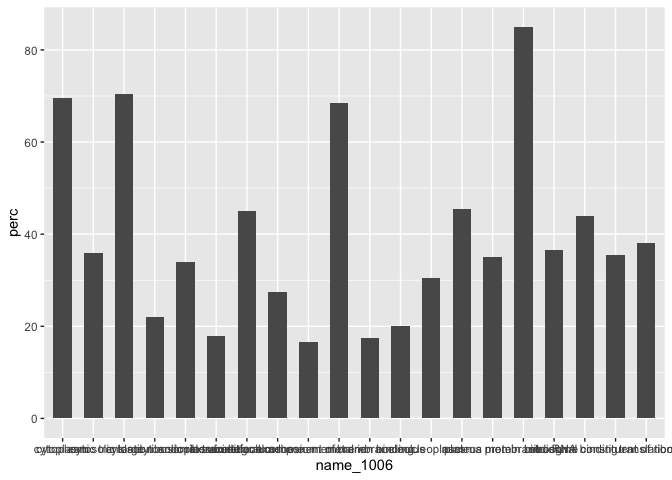<!-- -->

```r
go_plot[1:20,] %>% 
  ggplot(aes(x = reorder(name_1006, -perc), y = perc)) +
  geom_bar(stat = "identity", width = 0.6) +
  coord_cartesian(y = c(0,100)) +
  theme_minimal() +
  theme(axis.text.x = element_text(angle = 45, hjust = 1)) +
  labs(title = "Top 20 GO Terms", subtitle = "For DEGs at adjpval <= 0.05", x = "GO Term", y = "Percentage of DEGs assoc. with GO Term")
```

<!-- -->

```r
# let's all add the cellular compartment to our plot
component <- go_terms %>% 
  dplyr::select(name_1006, namespace_1003) %>% 
  distinct(name_1006, .keep_all = TRUE)

head(component)
```

```
##         name_1006     namespace_1003
## 1       cytoplasm cellular_component
## 2     translation biological_process
## 3       nucleolus cellular_component
## 4         cytosol cellular_component
## 5 plasma membrane cellular_component
## 6 protein binding molecular_function
```

```r
go_plot <- go_plot %>% 
  right_join(component, by = "name_1006")

head(go_plot)
```

```
##               name_1006   n total perc     namespace_1003
## 1       protein binding 170   200 85.0 molecular_function
## 2               cytosol 141   200 70.5 cellular_component
## 3             cytoplasm 139   200 69.5 cellular_component
## 4              membrane 137   200 68.5 cellular_component
## 5               nucleus  91   200 45.5 cellular_component
## 6 extracellular exosome  90   200 45.0 cellular_component
```


```r
go_plot[1:20,] %>% 
  ggplot(aes(x = reorder(name_1006, -perc), y = perc, fill = namespace_1003)) +
  geom_bar(stat = "identity", width = 0.6) +
  scale_fill_manual(values = c("maroon", "navy", "forest green")) +
  coord_cartesian(y = c(0,100)) +
  theme_minimal() +
  theme(axis.text.x = element_text(angle = 45, hjust = 1), legend.position = "bottom") +
  scale_y_continuous(breaks = seq(0, 100, 10)) +
  labs(title = "Top 20 GO Terms", subtitle = "For DEGs at adjpval <= 0.05", x = "GO Term", y = "Percentage of DEGs assoc. with GO Term")
```

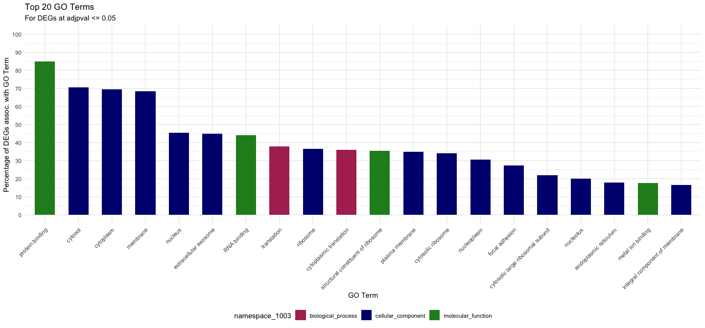<!-- -->

Let's look at the pathways associated with our DEGs   


```r
library(clusterProfiler)
```

```
## 
```

```
## clusterProfiler v4.4.4  For help: https://yulab-smu.top/biomedical-knowledge-mining-book/
## 
## If you use clusterProfiler in published research, please cite:
## T Wu, E Hu, S Xu, M Chen, P Guo, Z Dai, T Feng, L Zhou, W Tang, L Zhan, X Fu, S Liu, X Bo, and G Yu. clusterProfiler 4.0: A universal enrichment tool for interpreting omics data. The Innovation. 2021, 2(3):100141
```

```
## 
## Attaching package: 'clusterProfiler'
```

```
## The following object is masked from 'package:biomaRt':
## 
##     select
```

```
## The following object is masked from 'package:purrr':
## 
##     simplify
```

```
## The following object is masked from 'package:stats':
## 
##     filter
```

```r
library(DT)

# kegg <- enrichKEGG(gene = genes, organism = "hsa")

# aah, so when we input our genes as HGNC IDs, the function doesn't work. We'll use our Entrez IDs that we have

head(hgnc_to_entrez)
```

```
##   hgnc_symbol entrezgene_id
## 1       ABTB1         80325
## 2        ACTB            60
## 3       ACTG1            71
## 4        ADAR           103
## 5        AIF1           199
## 6       ALDOA           226
```

```r
kegg <- enrichKEGG(gene = hgnc_to_entrez$entrezgene_id, organism = "hsa")
```

```
## Reading KEGG annotation online:
```

```
## Reading KEGG annotation online:
```

```r
# kegg <- readRDS(here::here("data", "kegg_res.rds"))

kegg_res <- kegg@result

kegg_res %>% 
  slice_head(n = 5) %>% 
  datatable()
```

```{=html}
<div id="htmlwidget-d185ea9022025bf83be5" style="width:100%;height:auto;" class="datatables html-widget"></div>
<script type="application/json" data-for="htmlwidget-d185ea9022025bf83be5">{"x":{"filter":"none","vertical":false,"data":[["hsa03010","hsa05171","hsa05140","hsa04145","hsa04380"],["hsa03010","hsa05171","hsa05140","hsa04145","hsa04380"],["Ribosome","Coronavirus disease - COVID-19","Leishmaniasis","Phagosome","Osteoclast differentiation"],["71/150","77/150","10/150","13/150","10/150"],["158/8159","232/8159","77/8159","152/8159","128/8159"],[7.22010038270739e-87,1.71735309895873e-82,1.24852711320428e-06,3.96605971358009e-06,0.000116009695249561],[1.22019696467755e-84,1.45116336862012e-80,7.03336940438412e-05,0.000167566022898759,0.00392112769943517],[1.09441521590512e-84,1.3015728750003e-80,6.30834751934794e-05,0.000150292789146193,0.00351692549809196],["2197/6134/4736/6135/6136/6137/23521/9045/6138/6139/6141/6142/6143/6144/9349/6147/6152/6154/6155/6157/6158/6159/6122/6156/6160/6161/6164/11224/6165/6173/6167/6168/6170/6124/6171/6125/6128/6129/6130/6132/6133/6175/6176/6181/6204/6205/6206/6208/6210/6217/6218/6222/6223/6187/6224/6228/6229/6230/6232/6233/6235/6188/6189/6191/6193/6194/6201/6202/6203/3921/7311","103/2197/4938/4939/4940/6134/4736/6135/6136/6137/23521/9045/6138/6139/6141/6142/6143/6144/9349/6147/6152/6154/6155/6157/6158/6159/6122/6156/6160/6161/6164/11224/6165/6173/6167/6168/6170/6124/6171/6125/6128/6129/6130/6132/6133/6175/6176/6181/6204/6205/6206/6208/6210/6217/6218/6222/6223/6187/6224/6228/6229/6230/6232/6233/6235/6188/6189/6191/6193/6194/6201/6202/6203/3921/6772/7097/7311","1535/1915/2214/2215/3122/3123/3689/653361/6772/7097","60/71/11151/1535/2214/2215/3122/3123/3689/653361/6890/7097/7846","1535/2214/2215/353514/11025/102725035/653361/6688/6772/7305"],[71,77,10,13,10]],"container":"<table class=\"display\">\n  <thead>\n    <tr>\n      <th> <\/th>\n      <th>ID<\/th>\n      <th>Description<\/th>\n      <th>GeneRatio<\/th>\n      <th>BgRatio<\/th>\n      <th>pvalue<\/th>\n      <th>p.adjust<\/th>\n      <th>qvalue<\/th>\n      <th>geneID<\/th>\n      <th>Count<\/th>\n    <\/tr>\n  <\/thead>\n<\/table>","options":{"columnDefs":[{"className":"dt-right","targets":[5,6,7,9]},{"orderable":false,"targets":0}],"order":[],"autoWidth":false,"orderClasses":false}},"evals":[],"jsHooks":[]}</script>
```

