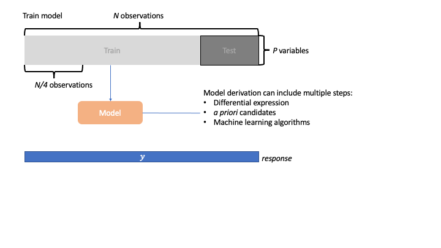
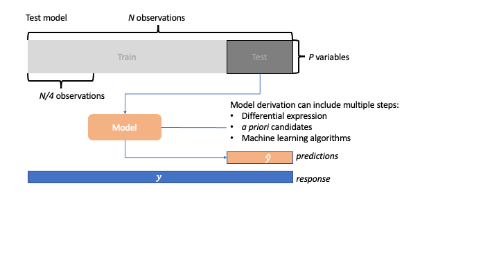
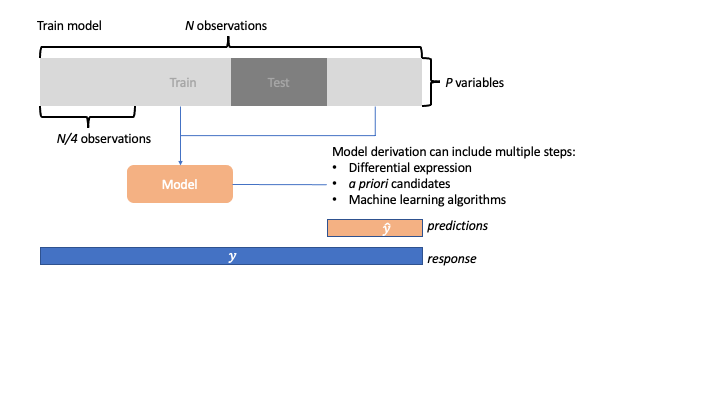
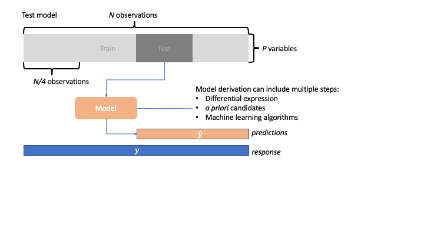
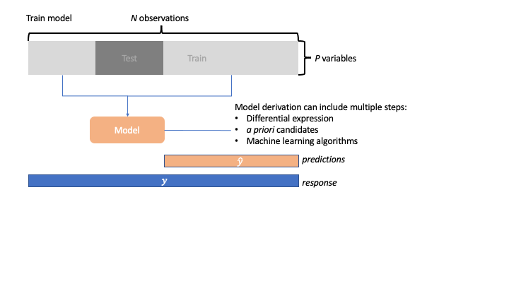
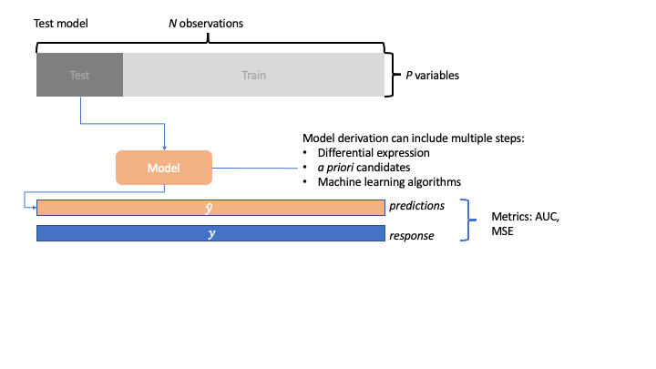

```{r, echo=F, message=F, warning=F}
## load libraries
knitr::opts_chunk$set(python.reticulate = FALSE)

library(dplyr)
library(ggplot2)
library(mixOmics)
library(ggvenn)

# helper functions
make_heatmap = function(X, y, panel){
  X = scale(X[, panel])
  X[which(X < -2)] <- -2
  X[which(X > 2)] <- 2
  gplots::heatmap.2(X, RowSideColors=mixOmics::color.mixo(factor(y)), key=TRUE)
}
```


background-image: url(img/la.svg)

---
background-image: url(img/cc.svg)

---

class: middle

# Learning outcomes

### 1. Describe what a biomarker is and give an example of one
### 2. Analyze simluated and breast cancer data to identify biomarkers
### 3. Discrimiminate the right and wrong to estimate the test error of a biomarker panel
### 4. Appreciate how easy it is to cherry-pick the data.

---

# What is a biomarker?

*A defined characteristic that is measured as an indicator of normal biologial processes, pathogenic processes, or biological responses to an exposure or intervention, including therapeutic interventions.*

.pull-left[
#### Types
- molecular
- histologic
- radiographic
- physiologic
]

.pull-right[
#### Categories
- susceptibility/risk biomarker
- diagnostic biomarker
- monitoring biomarker
- prognostic biomarker
- predictive biomarker
- response biomarker
- safety biomarker
]

<br>

[FDA-NIH Biomarker Working Group. BEST (Biomarkers, EndpointS, and other Tools) Resource [Internet]. Silver Spring (MD): Food and Drug Administration (US); 2016-. Available from: https://www.ncbi.nlm.nih.gov/books/NBK326791/ Co-published by National Institutes of Health (US), Bethesda (MD).](https://www.ncbi.nlm.nih.gov/books/NBK326791/)
]

---

## Examples of biomarkers

| Metric      | Description |
| :---        |    :----   |
| Diagnostic     | <ul><li> GFR for kidney disease</li> <li>sweat chloride for Cystic Fibrosis</li></ui> | 
| Monitoring  | <ul><li> Prostate-specific antigen (PSA) to assess cancer recurrence</li></ui>         |
| Response   |    <ul><li> Pharmacodynamic: CRP levels and tobacco use </li></ui>      | 
| Prognostic   | <ul><li> BRCA1/2 to assess the likelihood of breast cancer</li></ui>        | 
[FDA-NIH Biomarker Working Group. BEST (Biomarkers, EndpointS, and other Tools) Resource [Internet]. Silver Spring (MD): Food and Drug Administration (US); 2016-. Available from: https://www.ncbi.nlm.nih.gov/books/NBK326791/ Co-published by National Institutes of Health (US), Bethesda (MD).](https://www.ncbi.nlm.nih.gov/books/NBK326791/)
]

---

# Magic bullet biomarkers: do they exist?

.pull-left[

]

.pull-right[
**N terminal probrain natriuretic peptide (NTproBNP)**
is a rule-out test for acute heart failure

serum NTpBNP <= 300ng/L :
- sensitivity: 0.95 (0.93-0.96)
- negative predictive value: 0.98 (0.89-1)
- specificity: 0.43 (0.26-0.62)
- positive predictive value: 0.64 (0.57-0.73)

cardic imaging is required to confirm diagnosis if positive for heart failure.
]

[Roberts E et al., BMJ. 2015 Mar 4;350:h910.](https://pubmed.ncbi.nlm.nih.gov/24650281/)


---

# Why use a multimarker approach?

.center[]

[BMC Bioinformatics
. 2014 Mar 21;15:79. doi: 10.1186/1471-2105-15-79.](https://pubmed.ncbi.nlm.nih.gov/24650281/)


---

.center[]

[Singh A et al., AJRCCM 2018, 15:79-93.
](https://pubmed.ncbi.nlm.nih.gov/24650281/)
[Portt L. et al. Biochimica et Biophysica Acta 2011, 238-259]()


---

## Clinical utlity?

.pull-left[
### Single biomarker
| Pros      | Cons |
| :---        |    :----   |
| <ul><li> many real-world biomarkers</li> <li>easier to develop into a clinical test</li> <li>results are easier interpret</li></ui>     | <ul><li> not perfect</li> <li>can be generic (CRP)</li></ui> | 
]

.pull-right[
### Panel of biomarkers
| Pros      | Cons |
| :---        |    :----   |
| <ul><li> increasing real-world biomarkers (PROSIGNA)</li> <li>better at capturing the heterogeneity of the disease</li></ui>     | <ul><li> not perfect</li> <li>results are harder interpret</li></ui> | 
]
---


# Terminology review

| Term      | Synonym | Description
| ----------- | ----------- |
| biomarker panel | biomarker signatures, multimarker panels, models, algorithms, equations | two or more biomarkers that an algorithm or equation is based on
| training set | discovery cohort | dataset used to develop biomarker panels
| test set | validation cohort | an independent dataset not used when developing biomarker panels
| Technical replication      |        | confirmation of findings using the same samples, (e.g. measuring the same protein using different technologies in the same set of samples)
| validation   |  | confirmation of findings using samples from the original discovery cohort

Contrast with Deep Learning (DL) common practice:
- DL pipeline use a separate cohort for train, validation and test
- Biomarker literature there is discovery and validation cohort; the discovery cohort can be divided into train and validation set however cross-validation is used instead to tune-hyperparameters.

---

# How to identify biomarkers?

## A panel of biomarkers can be developed from any of the following approaches:
* differential expression
* machine learning methods
* *a prior* list of biomarkers
* combination of approaches

--

## THATS EASY! 

### The hard part is trying to estimate the test error in the absence of additional data!

---

## Case Studies 

## Case Study 1: Two cohorts (discovery + validation) - real data
### Data: Breast Cancer multi omics data from TCGA (part of mixOmics R-package)

*This data set is a small subset of the full data set from The Cancer Genome Atlas that can be analysed with the DIABLO framework. It contains the expression or abundance of three matching omics data sets: mRNA, miRNA and proteomics for 150 breast cancer samples (Basal, Her2, Luminal A) in the training set, and 70 samples in the test set. The test set is missing the proteomics data set.
[Bioinformatics. 2019 Sep 1;35(17):3055-3062](https://pubmed.ncbi.nlm.nih.gov/30657866/)

## Case Study 2: One cohort - simulated data
---

### Case Study 1: Method 1
 - Step 1: Differential expression (50 gene panel)
 - Step 2: train machine learning model

.pull-left[
```{r, out.width="80%", echo=F}
data("breast.TCGA")

pvals <- apply(breast.TCGA$data.train$mrna, 2, function(mrna){
  result <- aov(mrna ~ breast.TCGA$data.train$subtype)
  summary(result)[[1]][1, "Pr(>F)"]
})
fdrs <- p.adjust(pvals, "BH")
biomarker_diff_panel <- fdrs[order(fdrs, decreasing = FALSE)][1:50]

diff_model <- plsda(X=breast.TCGA$data.train$mrna[, names(biomarker_diff_panel)], Y=breast.TCGA$data.train$subtype, ncomp=2)
plotIndiv(diff_model, legend = TRUE)
```
]

.pull-right[
```{r, out.width="80%", echo=F}
make_heatmap(X = breast.TCGA$data.train$mrna,
             y = breast.TCGA$data.train$subtype,
             panel = names(biomarker_diff_panel))
```

]

> `r names(biomarker_diff_panel)`

---

## Case Study 1: Method 2
- using a machine learning model with variable selection (select 50 genes): sPLS-DA

.pull-left[
```{r, out.width="80%", echo=F}
splsda_model <- splsda(X = breast.TCGA$data.train$mrna, 
                 Y = breast.TCGA$data.train$subtype,
                 ncomp = 2,
                 keepX = c(25, 25))

plotIndiv(splsda_model)

biomarker_splsda_panel <- c(selectVar(splsda_model, 1)$name,
                                selectVar(splsda_model, 2)$name)
```
]

.pull-right[
```{r, out.width="80%", echo=F}
make_heatmap(X = breast.TCGA$data.train$mrna, 
             y = breast.TCGA$data.train$subtype, 
             panel = biomarker_splsda_panel)

```
]

> `r biomarker_splsda_panel`

---

class: center

## Overlap between biomarkers between the two approaches

```{r, echo=F, fig.width=9}
#devtools::install_github("yanlinlin82/ggvenn")

library(ggvenn)
p <- ggvenn(
  list(biomarker_diff_panel = names(biomarker_diff_panel),
       biomarker_splsda_panel = biomarker_splsda_panel),
  fill_color = c("#0073C2FF", "#EFC000FF"),
  stroke_size = 0.5, set_name_size = 2
  )
p

```

---

# How to determine the performance of biomarkers?

| Metric      | Description |
| :---        |    :----   |
| Area under the receiver <br> operating characteristic curve (AUROC)     | <ul><li> binary classification</li> <li>true vs. false positive rate</li></ui> | 
| Mean Square Error (MSE)   | <ul><li> regression </li> <li>difference between actual vs. observed squared</li></ui>         |
| Accuracy   |    <ul><li> classification </li> <li>proportion of correctly classified </li></ui>      | 
| F1 Score   | <ul><li> classification </li> <li>combines precision and recall</li></ui>        | 

[See formulas here](https://en.wikipedia.org/wiki/Receiver_operating_characteristic)

[J Natl Cancer Inst. 2015 Jun 24;107(8):djv153.](https://pubmed.ncbi.nlm.nih.gov/26109105/)

---

## Case Study 1: Apply biomarker panels to test cohorts

.pull-left[

### Method 1: Diff_plsda_biomarker_panel

#### Train (model built using this data)

```{r, echo=F}
## train
diff_predictions <- predict(diff_model, breast.TCGA$data.train$mrna[, names(biomarker_diff_panel)])
diff_train <- table(diff_predictions$class$centroids.dist[, "comp2"], breast.TCGA$data.train$subtype)
diff_train
```

Accuracy: `r sum(diag(diff_train))/sum(diff_train)` and Balanced Accuracy: `r round(mean(diag(diff_train)/colSums(diff_train)), 2)`


#### Test (apply model to independent cohort)

```{r, echo=F}
## test
diff_predictions <- predict(diff_model, breast.TCGA$data.test$mrna[, names(biomarker_diff_panel)])
diff_test <- table(diff_predictions$class$centroids.dist[, "comp2"], breast.TCGA$data.test$subtype)
diff_test
```

Accuracy: `r round(sum(diag(diff_test))/sum(diff_test), 2)` and Balanced Accuracy: `r round(mean(diag(diff_test)/colSums(diff_test)), 2)`

]

.pull-right[

### Method 2: splsda_biomarker_panel

#### Train (model built using this data)

```{r, echo=F}
## train
splsda_predictions <- predict(splsda_model, breast.TCGA$data.train$mrna)
splsda_train <- table(splsda_predictions$class$centroids.dist[, "comp2"], breast.TCGA$data.train$subtype)
splsda_train
```

Accuracy: `r sum(diag(splsda_train))/sum(splsda_train)` and Balanced Accuracy: `r round(mean(diag(splsda_train)/colSums(splsda_train)), 2)`


#### Test (apply model to independent cohort)

```{r, echo=F}
## test
splsda_predictions <- predict(splsda_model, breast.TCGA$data.test$mrna)
splsda_test <- table(splsda_predictions$class$centroids.dist[, "comp2"], breast.TCGA$data.test$subtype)
splsda_test
```

Accuracy: `r round(sum(diag(splsda_test))/sum(splsda_test), 2)` and Balanced Accuracy: `r round(mean(diag(splsda_test)/colSums(splsda_test)), 2)`

]

---

## Q: What if you don't have a test cohort?

### Anwers: split data and pretend you do have test cohorts:

#### Resampling strategies

| Type      | Description
| ----------- | ----------- |
| K-fold cross validation  (CV)    |  <ul><li> split data into K folds of equal size (can also be stratified across disease groups) </li></ul>   
| repeated K-fold cross-validation   |  <ul><li>repeat K-fold CV multiple times until metric values convergences </li></ul>
| nested cross-validation if hyperparameter tuning is required | <ul><li>repeat K-fold CV with each fold and select the best model to apply to test data </li></ul>

- bias: how are far is the model away from the true model (K=N has the lowest biased but high variance whereas lower values of K have higher bias but lower variance); K of 5 or 10 offer a good compromise.
---

## K-fold cross validation  (CV)

.center[]

---

## K-fold cross validation  (4-fold CV)

.center[]

---

## K-fold cross validation  (4-fold CV)

.center[]

---

## K-fold cross validation  (4-fold CV)
* Note: many approaches can be used to create the final model
.center[]

---

## K-fold cross validation  (4-fold CV)
* Note: many approaches can be used to create the final model
.center[]


---

## K-fold cross validation  (4-fold CV)
* Note: many approaches can be used to create the final model
.center[]


---

## K-fold cross validation  (4-fold CV)
* Note: many approaches can be used to create the final model
.center[]


---

## K-fold cross validation  (4-fold CV)
* Note: many approaches can be used to create the final model
.center[]


---

## K-fold cross validation  (4-fold CV)
* Note: many approaches can be used to create the final model
.center[]

---

## K-fold cross validation  (4-fold CV)
* Note: many approaches can be used to create the final model
.center[]

---

## K-fold cross validation  (4-fold CV)
* Note: many approaches can be used to create the final model
.center[]

---

## Case Study 2: Simulation scenerio (true error rate = 50%)

.pull-left[
```{r}
n <- 100; p <- 1000
group <- rep(c("group1", "group2"), each = n/2)
eset <- matrix(rnorm(n * p), nr = n)
colnames(eset) <- paste0("gene", 1:p)

pvals <- apply(eset, 2, function(i){
  t.test(i~group)$p.value
})

biomarkers <- pvals[order(pvals)][1:10]
as_tibble(data.frame(names = names(biomarkers),
           pvalues = biomarkers))
```
]

.pull-right[
```{r, out.width="90%"}
hist(pvals)
```

]

---

# How to cross-validate?

.pull-left[
## Wrong way to do cross-validation
 - subset dataset to selected biomarkers than apply cross-validation
 
```{r}
wrong_way_model <- plsda(X = eset[, names(biomarkers)], Y = group, ncomp=1)

cv <- perf(wrong_way_model, validation = "Mfold", folds = 5, auc=TRUE)
cv$auc
```

]

.pull-right[

## Right-way to do cross-validation
- DO NOT subset dataset and repeat the same model building process during each cross-validation train/test fold.

```{r}
right_way_model <- splsda(X = eset, keepX = 10, Y = group, ncomp=1)

cv <- perf(right_way_model, validation = "Mfold", folds = 5, auc=TRUE)
cv$auc
```

]

---

# I want to include differential expression in my approach
- within each cross-validation fold, start with **ALL** the data and perform differential expression, then use the top features to build the model and apply to the held out/test set.

.pull-left[
```{r}
cvIndex <- caret::createFolds(factor(group), k = 5)  ## dont load the caret package as it requires the pls packages which clashes with the mixOmics pls()

predictions <- lapply(cvIndex, function(fold){
  ## Create train and test dataests
  Xtrain <- eset[-fold, ]
  Xtest <- eset[fold, ]
  ytrain <- group[-fold]
  
  ## differential expression
  pvals <- apply(Xtrain, 2, function(i){
    t.test(i~ytrain)$p.value
  })
  biomarkers <- pvals[order(pvals)][1:10]
  
  ## plsda model
  model <- mixOmics::plsda(X = Xtrain[, names(biomarkers)], Y = ytrain, ncomp=1)
  as.numeric(predict(model, Xtest[, names(biomarkers)])$predict[, , "dim1"][, "group2"])
})
```
]

.pull-right[
```{r, out.width="60%", warning=F, message=F}
pROC::auc(group[unlist(cvIndex)], unlist(predictions), plot = TRUE)
```
]

---

## Nested cross-validation
 - apply cross-validation within each cross-validation fold (*e.g.* hyperparamter tuning)
 
.center[]
[Bioinformatics
. 2020 May 1;36(10):3093-3098](https://pubmed.ncbi.nlm.nih.gov/31985777/)

---

## Hyperparameter tuning (tune the number of variables to select)

### use a grid of values to find the biomarker panel with the least error rate

.pull-left[
```{r}
set.seed(1)
test.keepX = c(5, 10, 15, 50, 100, 200)
tune <- tune(method = "splsda", 
           X = breast.TCGA$data.train$mrna, 
           Y = breast.TCGA$data.train$subtype, 
           ncomp=1,
           test.keepX = test.keepX, 
           folds=5, dist="centroids.dist", progressBar = FALSE)

final_model <- splsda(X = breast.TCGA$data.train$mrna, 
           Y = breast.TCGA$data.train$subtype, 
           ncomp=1,
           keepX = test.keepX[which.min(tune$error.rate)])
# selectVar(final_model, ncomp=1)$name
```

> the optimal biomarker panel has `r test.keepX[which.min(tune$error.rate)]` genes.

]

.pull-right[
```{r, out.width="70%"}
plot(tune$error.rate ~ test.keepX, type="l", log="x", ylab = "Error rate")
```


]

---

## Estimate test error using only the TRAINING data

.pull-left[
```{r}
cvIndex <- caret::createFolds(factor(breast.TCGA$data.train$subtype), k = 5)  ## dont load the caret package as it requires the pls packages which clashes with the mixOmics pls()

predictions <- lapply(cvIndex, function(fold){
  ## Create train and test dataests
  Xtrain <- breast.TCGA$data.train$mrna[-fold, ]
  Xtest <- breast.TCGA$data.train$mrna[fold, ]
  ytrain <- breast.TCGA$data.train$subtype[-fold]
  
  ## find optimal panel
  test.keepX = c(5, 10, 15, 50, 100, 200)
  tune <- tune(method = "splsda", 
             X = Xtrain, 
             Y = ytrain, 
             ncomp=1,
             test.keepX = test.keepX, 
             folds=5, dist="centroids.dist", progressBar = FALSE)
  
  print(test.keepX[which.min(tune$error.rate)])
  
  final_model <- splsda(X = Xtrain, 
             Y = ytrain, 
             ncomp=1,
             keepX = test.keepX[which.min(tune$error.rate)])
  
  ## plsda model
  predict(final_model, Xtest)$class$centroids.dist
})
```
]

.pull-right[

### Accuracy

```{r}
conf_matrix <- table(unlist(predictions), breast.TCGA$data.train$subtype[unlist(cvIndex)])
sum(diag(conf_matrix))/sum(conf_matrix)
```


### Balanced Accuracy

```{r}
mean(diag(conf_matrix)/colSums(conf_matrix))
```

]

---

## Estimate test error using only the TEST (independent) data

```{r, message=F, warning=F}
predicted_labels <- predict(final_model, breast.TCGA$data.test$mrna)$class$centroids.dist

conf_matrix <- table(predicted_labels, breast.TCGA$data.test$subtype)
```

### Accuracy

```{r}
sum(diag(conf_matrix))/sum(conf_matrix)
```


### Balanced Accuracy

```{r}
mean(diag(conf_matrix)/colSums(conf_matrix))
```

---

# Should you biomarker? yes

.center[]


---

# Resources

.pull-left[
## Code
 - [Tidymodels](https://www.tidymodels.org/)
 - [mixOmics](https://mixomicsteam.github.io/Activities/)

## Slides
 - [xaringan](https://arm.rbind.io/slides/xaringan.html#137)
]

.pull-right[
## Biomarkers
- [Biomarker Discovery and Validation: Statistical Considerations](https://pubmed.ncbi.nlm.nih.gov/33545385/)
- [BEST (Biomarkers, EndpointS, and other Tools) Resource](https://www.ncbi.nlm.nih.gov/books/NBK326791/)

## Cross-validation
- [Resampling techniques](https://hastie.su.domains/MOOC-Slides/cv_boot.pdf)
]


---

class: middle, center

background-image: url(img/bkg.svg)

# THANK YOU!

August 05, 2022 | 12:00-14:00<br><br>`r fontawesome::fa("link")` [lab](https://cbl-hli.github.io/)<br>`r fontawesome::fa("github")` [code](https://github.com/Phillip-a-richmond/PrecisionHealthVirtualEnvironment/tree/main/Workshops)<br>`r fontawesome::fa("twitter")` [asingh_22g](https://twitter.com/asingh_22g)