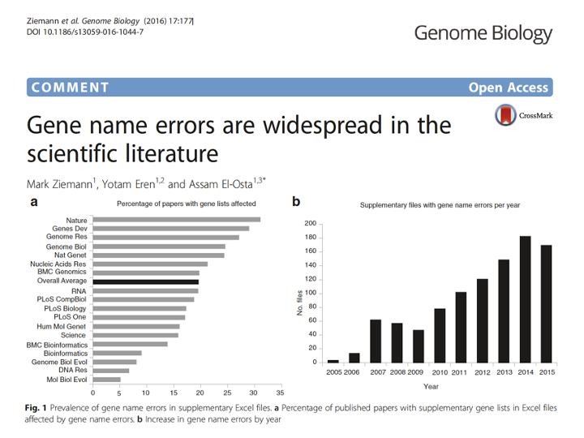

```{r, echo=F, message=F, warning=F}
## load libraries
knitr::opts_chunk$set(python.reticulate = FALSE)

library(dplyr)
library(ggplot2)
library(mixOmics)
library(tsne)
library(GGally)
library(gt)
library(emo)  #install.packages("devtools"); devtools::install_github("hadley/emo")
```


background-image: url(img/la.svg)

---
background-image: url(img/cc.svg)

---

class: middle

# Learning outcomes

### 1. Appreciate the importance exploratory data analysis (EDA) of omics data as a pre-requiste for any research study
### 2. Use R/Python to apply standard EDA techniques to omics data to find biological or technical factors that may affect omics data
### 3. Differentiate between clustering and dimension reduction techniques and know when to use what.

---

## RStudio setup

.pull-left[
### on local machine
* install [docker](https://docs.docker.com/get-docker/)

```{bash, eval=F}
docker --version #<<
docker login
```

### build docker image and push to DockerHub
* update DockerHub username in Makefile

```{bash, eval=F}
git clone https://github.com/Phillip-a-richmond/PrecisionHealthVirtualEnvironment.git
cd Workshops/eda
make build
make push
```

**instructions are for Mac**
]

.pull-right[
### on sockeye

```{bash, eval=F}
ssh <cwl>@sockeye.arc.ubc.ca
mkdir -p /scratch/tr-precisionhealth-1/Workshops/StudentSpaces/$USER/ && cd "$_"
cp -R /project/tr-precisionhealth-1/PrecisionHealthVirtualEnvironment/Workshops/eda/ ./

## if on own allocation
git clone https://github.com/Phillip-a-richmond/PrecisionHealthVirtualEnvironment.git
cd Workshops/eda
```

### pull docker image

```{r, eval=F}
sh get_rstudio.sh
```


]

---

class: center, top

```{r, out.width="80%", echo=FALSE}

```

---

class: center, top

```{r, out.width="80%", echo=FALSE}

```

???

An integrated genomic-based approach to individualized treatment of patients with advanced-stage ovarian cancer.
identified a set of genes that could differentiate between patients who did (CR) and did not (NR) respond to primary platinum-based chemotherapy.Then, following Bild et al,2 they scored each tumor for the levels of five different oncogenic pathways. They reported that three pathways (Src, E2F3, and Myc) stratify the NRs into subgroups with significantly different survival characteristics, suggesting how further therapies might be targeted for these patients.

Some Problems: 1) response and survival are confounded by run date (when samples were ran), 2) changes in survival status found (patients shifted from alive to dead, vice-versa).
Why does date matter? Change in reagents, technicians, freezers may have changed etc.

Common genetic variants account for differences in gene expression among ethnic groups (found 78% of the genes were differentially expression between ethnic groups (European/Asians)) confounded with run date

Genetic signatures of exceptional longevity in humans: found snps predictive of old (100 years) age. Younger and older people were run on different genotyping platforms.

---

```{r, out.width="80%", echo=FALSE}

```

???

The original paper, published in the Proceedings of the National Academy of Sciences (PNAS) by members of the Mouse ENCODE (Encyclopedia of DNA Elements) consortium, compared gene-expression profiles from selected tissues in mice and humans. The authors concluded that specific tissues in mice had more in common with other mouse tissues than with the same tissue in humans.

Dr. Gilad shows this what confounded with batch (run date). After correcting for batch the tissues (mouse/human) clustered together.

---

## Gene names

.pull-left[
```{r, echo=FALSE}

```
]
.pull-right[
```{r, echo=FALSE}

```

* [source](https://robaboukhalil.medium.com/how-to-fix-excels-gene-to-date-conversion-5c98d0072450)
]
???

Details:
Looked in the 35,175 supplementary files of18 journals (2005-2015) across many species (drosophila, h.sapeins, mouse) – 7,467 associated with 3,597 published papers
Problem is getting worse
Gene name errors increased at an annual rate of 15% whereas the increase in the publication rate is 3.8%/year (but does Figure b above have equal number of papers per year?)

---

# What does processed omics data look like?

```{r, echo=FALSE}

```

* data pre-processing is specific for each omics data modality and is beyond the scope of this workshop.

---

# What are the characteristics of omics data?

.center[]
???

obsm: metadata for observations

obsp: pariwise annotation of observations

varm: metadata for observations

varp: pariwise annotation of observations

variables = features

observations = samples


---

# Terminology review

| Term      | Synonym | Description
| ----------- | ----------- |
| Variable      | feature, dimension       | a measurable quantity that describes an observation's attributes. *e.g.* age, sex, gene, protein abundance, single nucleotide variants, operational taxonomic units, pixels etc. 
| Observation   | sample, observation, assay, array | A single entity belonging to a larger grouping. *e.g.* patients, subjects, participants, cells, mice. 
| component | factors, latent variable | 

---

# Make a fake dataset with some outliers

* 100 samples (observations), 1000 genes (variables)
* add 5 outlier samples

```{r, warning=F}
n_total <- 100; p_total <- 1000; 

set.seed(1)
n_pcs=2
sigma <- matrix(c(1, 0.6, 0.6, 1), nr = n_pcs)
pcs <- matrix(rnorm(n_pcs * n_total), nc = n_pcs)
pcs <- (pcs %*% chol(sigma)) 
pcs[1:5,] <- pcs[1:5,]+5
X <- pcs %*% matrix(rnorm(n_pcs * p_total), nr = n_pcs)
# X[1:5, ] <- scale(X[1:5, ] + rnorm(p_total, mean=2, sd=3))
rownames(X) <- paste0("Sample", 1:nrow(X)) 
colnames(X) <- paste0("Gene", 1:ncol(X))
X <- data.frame(X)

X[1:5,1:5]
```
* [Cholesky Decomposition](https://towardsdatascience.com/behind-the-models-cholesky-decomposition-b61ef17a65fb)

---

# How can we identify which samples/variables are outliers?

.pull-left[
## boxplots
```{r, out.width="70%"}
boxplot(t(X))
```

]

.pull-right[
## SPLOM plots (Scatter plot matrix)
```{r, out.width="70%"}
pairs(X[,sample(ncol(X), 5)])
```
]

---

# How can we identify which samples/variables are outliers?

## correlation matrix
.pull-left[
```{r, out.width="70%"}
par(mar=c(1,1,1,1))
gplots::heatmap.2(cor(t(X)), margins = c(1,1), trace = "none")
```
]

.pull-right[

## other heatmap functions
* [ComplexHeatmap](https://jokergoo.github.io/ComplexHeatmap-reference/book/)
* [NMF::aheatmap()](https://jokergoo.github.io/ComplexHeatmap-reference/book/)
* [mixOmics::cim()](https://rdrr.io/cran/mixOmics/man/cim.html)
* [seaborn.heatmap()](https://seaborn.pydata.org/generated/seaborn.heatmap.html)
* [scanpy.pl.heatmap()](https://scanpy.readthedocs.io/en/stable/generated/scanpy.pl.heatmap.html)

]

---

class: center, middle

# How to get something like this?

```{r, echo=F}
dat <- prcomp(X, rank. = 2, scale. = TRUE, center = TRUE)
dat$x %>% 
  as.data.frame() %>% 
  ggplot(aes(x = PC1, y = PC2)) +
  geom_point(size=6) +
  ylab("") +
  xlab("") +
  theme_classic() +
  theme(axis.title.x=element_blank(),
        axis.text.x=element_blank(),
        axis.ticks.x=element_blank(),
        axis.title.y=element_blank(),
        axis.text.y=element_blank(),
        axis.ticks.y=element_blank())

```

---

# Dimension reduction (DR) methods

.center[]

* [Ten quick tips for effective dimensionality reduction](https://journals.plos.org/ploscompbiol/article/comment?id=10.1371/annotation/894302e5-1622-41bd-af48-c3aa27bff7d5)

---

.right[]
.center[]

---

## 1) Choose an appropriate DM method
<!-- * depends on nature of data -->
<!-- * linear methods model global structure whereas non-linear are focused on modelling local structure -->

.center[]
- **PCA**: linear method, reduces noise by transforming data, fits ellipsoid to data (models global structure) - can apply to any data
- **tSNE**: non-linear method, models local structure (distance between clusters is meaningless) - commonly used for single cell data
- **PHATE**: non-linear method: models both local and global structure; useful to model differentiation trajectories

---

## Principal Component Analysis (PCA): PC<sub>*nxk*</sub> = X<sub>*nxp*</sub>V<sub>*pxk*</sub>

.center[]

- transform X which contains 3 variables (Gene 1-3) into PC which contain 2 variables (PC1-2)

[Genius blog](https://kindsonthegenius.com/blog/dimensionality-reduction-and-principal-component-analysis-pca/)

---

## Principal Component Analysis (PCA): PC<sub>*nxk*</sub> = X<sub>*nxp*</sub>V<sub>*pxk*</sub>

.center[]
[Nature Methods volume 14, pages 641–642 (2017)](https://www.nature.com/articles/nmeth.4346)

---

## Singular Value Decomposition: X<sub>*nxn*</sub> = U<sub>*nxk*</sub>D<sub>*kxk*</sub>V<sup>T</sup><sub>*kxp*</sub>

```{r}
?prcomp
methods(prcomp)
```

```{r, eval=F}
getAnywhere(prcomp.default)
```

> s <- svd(x, nu = 0, nv = k)

> r$x <- x %*% s$v

### Properties

- D is a diagnoal matrix containing the variances associated with each PC.
- the proportion of variation explained is a useful measure of how well PCA summarizes your data.
- assumes that data is centered (subtract the mean value of each variable from all values of that variable)
- PCs are uncorrelated

---

class: center

## Edgar Anderson's Iris Data

.left[?iris: This famous (Fisher's or Anderson's) iris data set gives the measurements in centimeters of the variables sepal length and width and petal length and width, respectively, for 50 flowers from each of 3 species of iris. The species are Iris setosa, versicolor, and virginica.]

```{r, echo=FALSE, message=F, warning=F, out.width="40%"}
p <- ggpairs(iris, mapping = aes(color = Species), columns = c("Sepal.Length", "Sepal.Width", "Petal.Length", "Petal.Width" ))
print(p, progress = F)
```

---

## Apply PCA to IRIS

```{r}
X <- iris[, setdiff(colnames(iris), "Species")]
y <- iris$Species

pca.res <- pca(X, ncomp = 2, scale = TRUE)
pca.res
```

? first 2 PCs explain 95% of the variation in the data. `r emo::ji("wow")`

---

## Plot samples: Component plot

```{r, out.width="40%", fig.align="center"}
plotIndiv(pca.res, group=y, legend=TRUE)
```
---

## Plot variables: Correlation circle

```{r, out.width="40%", fig.align="center"}
plotVar(pca.res)
```

[BioData Min. 2012 Nov 13;5(1):19.](https://pubmed.ncbi.nlm.nih.gov/23148523/)

---

## biplot: plot observations and variables

```{r, out.width="40%", fig.align="center"}
biplot(pca.res)
```
---

## Sanity check

### Sepal length is great for flower 132 as compared to flower 42

```{r}
rbind(iris[42,], iris[132,]) %>% 
  mutate(flower = rownames(.)) %>% 
  gt() %>% 
  tab_style(
    style = list(
      cell_fill(color = "lightcyan"),
      "font-variant: small-caps;"
    ),
    locations = cells_body(columns = Sepal.Length)
  )
```


---

## PCA fails in non-linear settings: *eg.* single cell omics

.center[]

[Nature Methods volume 14, pages 641–642 (2017)](https://www.nature.com/articles/nmeth.4346)

---

## t-SNE (t-distributed Stochastic Neighbourhood Embedding)

Goal: preserve distances between points in a neighbourhood (controlled by the perplexity) in a lower dimensional space.

```{r}
?tsne
```

- P = pairwise probabilities between observations given expected number of neighbours using a Gaussian distribution
- Q = pairwise probabilities of randomly generated observations in lower dimensions using a t-distribution with 1 degree of freedom
- use Kullback-Leibler (KL) divergence loss to minimize loss and update lower bound (Q)
- update randomly generated point using gradient descent using derivative of KL loss

Key takeaways
1. Value of perplexity affects clustering (recommended range between 5-50)
2. cluster size (spread of points in a cluster) CANNOT be interpreted
3. distance between clusters CANNOT be interpreted

[How to use t-SNE effectively](https://distill.pub/2016/misread-tsne/)
[StatQuest: t-SNE, Clearly Explained](https://www.youtube.com/watch?v=NEaUSP4YerM)
[tSNE math explained](https://towardsdatascience.com/t-sne-clearly-explained-d84c537f53a)

---

## Apply tSNE to IRIS

.pull-left[
```{r, message=F, warning=F, eval=F}
neighbours <- c(5, 25, 35, 50)

tsne_all <- lapply(neighbours, function(i){
  dims <- as.data.frame(tsne(iris[, setdiff(colnames(iris), "Species")], k = 2, perplexity = i))
  dims$perplexity <- factor(i)
  dims$Species <- iris$Species
  dims
}) %>% 
  do.call(rbind, .)

p <- tsne_all %>% 
  ggplot(aes(x = V1, y = V2, color = Species)) +
  geom_point()+
  facet_wrap(~perplexity, scales = "free") +
  xlab("Dim 1") +
  ylab("Dim 2") +
  theme_classic()


```
]

.pull-right[
```{r, echo=F, eval=F}
p
```

]

---

## Apply PCA+tSNE to single cell data

.center[]

[Genome Biol. 2019 Dec 23;20(1):295.](https://pubmed.ncbi.nlm.nih.gov/31870412/)

???
Current approaches to normalization and transformation induce variability in the fraction of zeros across cells to become the largest source of variability which in turn biases clustering algorithms to produce false-positive results based on distorted latent factors. a First principal component (PC) from the technical replicates dataset plotted against fraction of zeros for each cell. A red to blue color scale represents total UMIs per cell. b As a but for the monocytes biological replicates data. c Using the technical replicates, we applied t-distributed stochastic neighbor embedding (tSNE) with perplexity 30 to the top 50 PCs computed from log-CPM. The first 2 tSNE dimensions are shown with a blue to red color scale representing the fraction of zeros. d As c but for the biological replicates data. Here, we do not expect to find differences, yet we see distorted latent factors being driven by the total UMIs. PCA was applied to 5000 random genes

---

## GLM-PCA

.pull-left[
.center[]

[Genome Biol. 2019 Dec 23;20(1):295.](https://pubmed.ncbi.nlm.nih.gov/31870412/)
]

.pull-right[
SCTransform in Seurat:

*In particular, two recent studies proposed to use generalized linear models (GLMs), where cellular sequencing depth was included as a covariate, as part of scRNA-seq preprocessing workflows. Our **sctransform** approach utilizes the Pearson residuals from negative binomial regression as input to standard dimensional reduction techniques, while **GLM-PCA** focuses on a generalized version of principal component analysis (PCA) for data with Poisson-distributed errors.*

[Genome Biol. 2019;20(1):296.](https://pubmed.ncbi.nlm.nih.gov/31870423/)

[Genome Biol. 2022; 23: 27.](https://www.ncbi.nlm.nih.gov/pmc/articles/PMC8764781/#CR9)

]


???
GLM-PCA dimension reduction is not affected by unwanted fraction of zeros variability and avoids false-positive results. a First GLM-PCA dimension (analogous to the first principal component) plotted against the fraction of zeros for the technical replicates with colors representing the total UMIs. b As a but using monocytes biological replicates. c Using the technical replicates, we applied t-distributed stochastic neighbor embedding (tSNE) with perplexity 30 to the top 50 GLM-PCA dimensions. The first 2 tSNE dimensions are shown with a blue to red color scale representing the fraction of zeros. d As c but for the biological replicates data. GLM-PCA using the Poisson approximation to the multinomial was applied to the same 5000 random genes as in Fig. 3

---

## PHATE

.pull-left[
```{r}
write.table(iris, "iris.txt", sep="\t", row.names = F)
library(reticulate)
use_python('/usr/local/bin/python3')
```


```{python}
import os
import pandas as pd
import numpy as np
import phate # https://github.com/KrishnaswamyLab/PHATE

# import data
data = pd.read_csv("slides/iris.txt", sep="\t")
print(data.head())
print("dims: ", data.shape)

# run PHATE
phate_op = phate.PHATE()
data_phate = phate_op.fit_transform(data.iloc[:,1:4])
np.savetxt("slides/phate.csv", data_phate, delimiter=",")
```
]


.pull-right[
```{r}
library(dplyr)
library(ggplot2)

## import data
phate <- read.csv("slides/phate.csv", header = FALSE)
dim(phate)

## plot
phate %>% 
  mutate(Species = iris$Species) %>% 
  ggplot(aes(x = V1, y = V2, color = species)) +
  geom_point() +
  theme_classic() +
  xlab("Dim 1") +
  ylab("Dim 2")
```


---

## 10 Tips for effective DR

.pull-left[
### 1) Choose an appropriate DM method
<!-- * depends on nature of data -->
<!-- * linear methods model global structure whereas non-linear are focused on modelling local structure -->

### 2) Preprocess input data
<!-- * center each variable: center of the data cloud is the new origin -->
<!-- * scaling: makes the standard deviation of each variable equal to 1 such that each variable contributes equally when using DR methods that maximize variance -->

### 3) Handle categorical input data 
<!-- * CA/MCA for data with categorical variables -->
<!-- * think of MCA as converting categorical data to numeric and using similar factorization methods (SVD) with eigenvalue correction; see details (https://personal.utdallas.edu/~herve/Abdi-MCA2007-pretty.pdf) and ade4::mcoa(). -->
<!-- * or apply variable transformation before PCA (binary variables, optimal scaling) -->

### 4) Use DR methods for similiarity/dissimilarity matrices
<!-- * DR methods are also recommend when data on original variables is not present -->

### 5) Decide on number of dimensions to retain
<!-- * PCA: use eigenvalues to guide # of dimensions to keep -->
<!-- * t-SNE: use # of dims that minimizes the KL divergence loss -->

]

.pull-right[
### 6) Apply the correct aspect ratio to plots
<!-- * PCA: resize axes based on proportion of variability explained -->
<!-- * t-SNE: each dimension has an equal weight so therefore square plots will suffice -->

### 7) What do the new dimensions mean?
<!-- * some DR methods such as PCA produce interpretable visualizations (component plots, correlation circle, biplots) -->

### 8) Find the hidden signal
<!-- * DR methods such as PCA can be used reduce noise, e.g. use top 50 PCs and apply t-SNE as in the case for single cell data. -->
<!-- * t-SNE should not be used for clustering as it does not preserve distances nor densities -->
<!-- * observations need not cluster into groups but along a gradient -->

### 9) Favor multidomain data
<!-- * STATIS and DISTATIS are generalization of PCA to multiple data matrices (more on the on unsupervised data integration) -->

### 10) Robustness of results and quantify uncertainties
<!-- * test different parameters to see how clustering changes -->
<!-- * outliers can affect DR methods; robust variants are available (e.g. robust PCA) -->


]

---


# Biplot


---


# Resources

## Other slide resources
 - [10x RNASeq Dimension Reduction](https://www.bioinformatics.babraham.ac.uk/training/10XRNASeq/Dimension%20Reduction.pdf)


 - [xaringan](https://arm.rbind.io/slides/xaringan.html#137)

## Git
 - [Get Git!](https://uidaholib.github.io/get-git/6resources.html)
 - [Let's Git started](https://happygitwithr.com/)
 - [.gitignore](https://zellwk.com/blog/gitignore/)
 - [GitHub Actions]()
 
 
## Problem Set

1) Git-LFS
2) GH-Pages
3) use RStudio with Git(Hub)
4) advanced git commands: stash, rebase, 

## Solutions