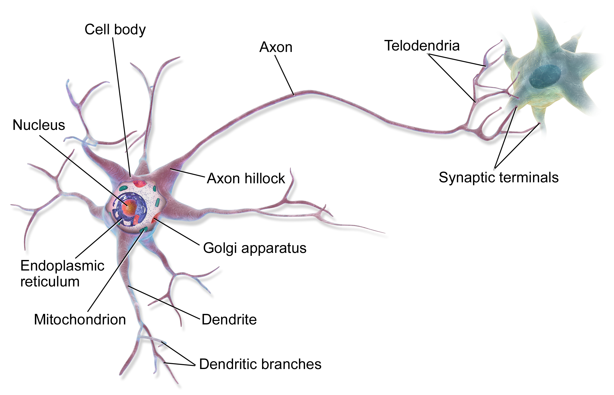

```{r, echo=F, message=F, warning=F}

library(dplyr)
library(ggplot2)
library(mixOmics)
data(breast.TCGA)

```


background-image: url(img/la.svg)

---
background-image: url(img/cc.svg)

---

class: middle

# Learning outcomes

### 1. Contrast between unsupervised and supervised learning
### 2. Apply supervised integrative methods to real world data
### 3. Describe how biological information can be incorporated into supervised methods

---

*"In supervised learning, the goal is to predict the value of an outcome measure based on a number of input measures;
in unsupervised learning, there is no outcome measure, and the goal is to
describe the associations and patterns among a set of input measures."* [Elements of statistical learning, 2008 page 3](https://hastie.su.domains/Papers/ESLII.pdf)

.pull-left[

### Unsupervised (clustering)
.center[]
[Chire 2017](https://commons.wikimedia.org/wiki/File:K-means_convergence.gif)
]

.pull-right[

### Supervised (regression/classification)
.center[]
[Tensorflow playground](https://playground.tensorflow.org/)
]


---

# Multiomics data integration


.center[]

---

# Supervised multiomics data integration


.center[]
[Nat Rev Genet
. 2015 Feb;16(2):85-97.](https://pubmed.ncbi.nlm.nih.gov/25582081/)

---

# Dataset used in this talk

## Breast Cancer multi omics data from TCGA

This data set is a small subset of the full data set from The Cancer Genome Atlas that can be analysed with the DIABLO framework. It contains the expression or abundance of three matching omics data sets: mRNA, miRNA and proteomics for 150 breast cancer samples (Basal, Her2, Luminal A) in the training set, and 70 samples in the test set. The test set is missing the proteomics data set.

Usage
```{r}
library(mixOmics)
data(breast.TCGA)
```

---

## Concatenation-based

- strongest dataset will influence the biomarkers selected

.pull-left[
```{r}
concat_model <- splsda(X = do.call(cbind, breast.TCGA$data.train[1:3]), 
                      Y = breast.TCGA$data.train$subtype, keepX=50, ncomp=1)
biomarkers <- selectVar(concat_model)$name

p <- data.frame(dataset = names(breast.TCGA$data.train[1:3]),
           num = sapply(breast.TCGA$data.train[1:3], function(i){length(intersect(colnames(i), biomarkers))})) %>% 
  ggplot(., aes(x = dataset, y = num)) +
  geom_bar(stat="identity")
           

```
]

.pull-right[
```{r, echo=F}
p
```

]

---

## Data Integration Analysis for Biomarker discovery using Latent cOmponents (DIABLO)

.pull-left[
```{r}
list.keepX <- list(mirna = c(16, 17), mrna = c(18,5), protein = c(5, 5))

diablo <- block.splsda(X = breast.TCGA$data.train[1:3], 
                       Y = breast.TCGA$data.train$subtype, 
                       keepX=list.keepX)
```
]

.pull-right[
```{r, echo=F}
plotDiablo(diablo, ncomp = 1)
```
]

[Bioinformatics. 2019 Sep 1;35(17):3055-3062.](https://pubmed.ncbi.nlm.nih.gov/30657866/)

---

## DIABLO

.pull-left[
```{r, out.width="80%"}
plotIndiv(diablo) 
```
]

.pull-right[
```{r, out.width="80%"}
plotVar(diablo, var.names = c(TRUE, TRUE, TRUE),
        legend=TRUE, pch=c(16,16,1))
```
]

---

## DIABLO

.pull-left[
```{r, message=F, warning=F}
cimDiablo(diablo, color.blocks = c('darkorchid', 'brown1', 'lightgreen'), 
          comp = 1, margin=c(8,20), legend.position = "right")
```
]

.pull-right[
```{r, message=F, warning=F}
network(diablo, blocks = c(1,2,3),
        color.node = c('darkorchid', 'brown1', 'lightgreen'), 
        cutoff = 0.6)
```

]

---

## DIABLO

```{r}
set.seed(123) # for reproducibility in this vignette
perf_diablo <- perf(diablo, validation = 'Mfold', folds = 5, 
                   nrepeat = 3, 
                   dist = 'centroids.dist')
```

.pull-left[
```{r, out.width="70%"}
plot(perf_diablo)
```
]

.pull-right[
```{r, out.width="70%"}
auroc(diablo, roc.block = "mrna", roc.comp = 2)
```

]

---

## From biological to artifical neural networks (ANNs)

.pull-left[
.center[]
[Neural circuit](https://en.wikipedia.org/wiki/Neural_circuit)
]

.pull-right[
.center[]
[Yee NS. World J Transl Med 2021(9):1-10](https://www.wjgnet.com/2220-6132/full/v9/i1/WJTM-9-1-g002.htm)
]

---

## ANN structure captures hierarchical relationships

.pull-left[
.center[]
[3brown1blue](https://gfycat.com/gifs/search/3brown1blue)
]

.pull-right[
.center[]
[Knowledge-primed neural networks](https://phys.org/news/2020-08-deep-cell-networks-ai-single-cell.html)

[Genome Biology volume 21, Article number: 190 (2020)](https://genomebiology.biomedcentral.com/articles/10.1186/s13059-020-02100-5)
]

---

# Pathway-aware multi-layered hierarchical NETwork (P-NET)

.center[]
[Nature. 2021 Oct;598(7880):348-352.](https://pubmed.ncbi.nlm.nih.gov/34552244/)

[P-NET github](https://github.com/marakeby/pnet_prostate_paper)

---

# P-NET

.center[]
[Nature. 2021 Oct;598(7880):348-352.](https://pubmed.ncbi.nlm.nih.gov/34552244/)

---

# Multimodal data integration

.center[]

[Suresh H et al., In Procee.dings of Machine Learning for Healthcare 2017](https://proceedings.mlr.press/v68/suresh17a.html)

---

## Multi-Omics Graph cOnvolutional NETworks (MOGONET)

.center[]

[Nature Communications volume 12, Article number: 3445 2021)](https://www.nature.com/articles/s41467-021-23774-w) | [code](https://github.com/txWang/MOGONET)

---

.center[]
[Singh A et al., Handbook of Biomarkers and Precision Medicine CRC Press 2019:596](https://www.taylorfrancis.com/books/edit/10.1201/9780429202872/handbook-biomarkers-precision-medicine-claudio-carini-mark-fidock-alain-van-gool)

---

class: middle, center

background-image: url(img/bkg.svg)

# THANK YOU!

August 08, 2022 | 12:00-14:00<br><br>`r fontawesome::fa("link")` [lab](https://cbl-hli.github.io/)<br>`r fontawesome::fa("github")` [code](https://github.com/Phillip-a-richmond/PrecisionHealthVirtualEnvironment/tree/main/Workshops)<br>`r fontawesome::fa("twitter")` [asingh_22g](https://twitter.com/asingh_22g)