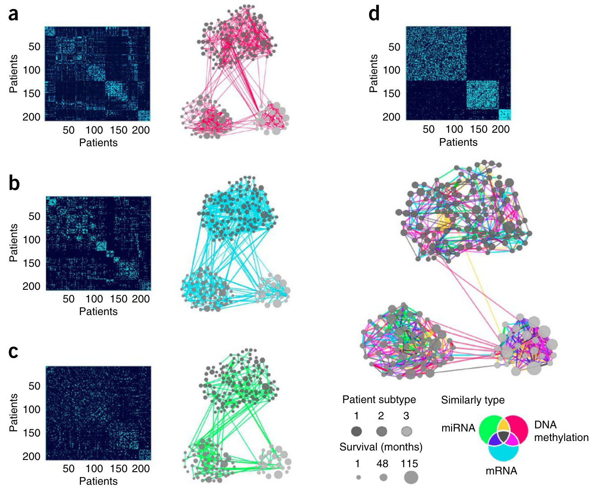

```{r, echo=F, message=F, warning=F}
# .libPaths(paste0(getwd(), "/R_Libs_4.1.0/"))
library(reticulate)
use_python("/usr/bin/python3", required=TRUE)

library(mixOmics)
data("breast.TCGA")

library(dplyr)
library(factoextra)
library(tidyr)
```


background-image: url(img/la.svg)

---
background-image: url(img/cc.svg)

---

class: middle

# Learning outcomes

### 1. Contrast between unsupervised and supervised learning
### 2. Develop an intuition for how multiomics methods are trying to explain the underlying biology
### 3. Give examples of methods that integrate multiomics data and what each is trying to acheive
### 4. Apply a few unsupervised integrative methods to real world data

---

*"In supervised learning, the goal is to predict the value of an outcome measure based on a number of input measures;
in unsupervised learning, there is no outcome measure, and the goal is to
describe the associations and patterns among a set of input measures."* [Elements of statistical learning, 2008 page 3](https://hastie.su.domains/Papers/ESLII.pdf)

.pull-left[

### Unsupervised (clustering)
.center[]
[Chire 2017](https://commons.wikimedia.org/wiki/File:K-means_convergence.gif)
]

.pull-right[

### Supervised (regression/classification)
.center[]
[Tensorflow playground](https://playground.tensorflow.org/)
]


---

# Unsupervised multiomics

.center[]

---

# Terminology review


| Term      | Synonym | Description
| ----------- | ----------- |
| multiomics      |    multiview, multidomain, mulitmodal    | confirmation of findings using the same samples, (e.g. measuring the same protein using different technologies in the same set of samples)
| validation   |  | confirmation of findings using samples from the original discovery cohort
| dataset | block, table, data matrix | a 2D matrix comprises of observations (*n*) and variables (*p*)
|latent variable | component, embedding, hidden variable | low-dimensional variable that contains information about the high dimensional dataset

---

.center[]
.right[]
[Sankaran K and Holmes SP. Front Genet. 2019 Aug 28;10:627](https://pubmed.ncbi.nlm.nih.gov/31555316/)

---

# Concatenated PCA 

$$\Huge X = \left[ X^{1} | ... | X^{J} \right] $$

```{r}
pca_res <- breast.TCGA$data.train[1:3] %>% 
  do.call(cbind, .) %>% 
  prcomp(x = ., rank. = 2, center = TRUE, scale. = TRUE)
```

.pull-left[
```{r, echo=F, message=F, warning=F, out.width="60%"}
factoextra::fviz_pca_ind(pca_res, geom = "point", 
             col.ind = breast.TCGA$data.train$subtype,
             addEllipses = TRUE)  +
  ggtitle("") + 
  theme(text = element_text(size = 30)) +
  theme(legend.position = c(0.9, 0.9))
```
]

.pull-right[
```{r, echo=F, message=F, warning=F, out.width="70%"}
col.var <- factor(rep(names(breast.TCGA$data.train[1:3]), sapply(breast.TCGA$data.train[1:3], ncol)))
factoextra::fviz_pca_var(pca_res, labelsize = 3, select.var = list(cos2 = 20), col.var=col.var) +
  ggtitle("") + theme(text = element_text(size = 25))
```
]
---

# Limitation of Concatenated PCA

- provides relationship between variables but not sets of variables
- datasets with more variables can dominate the resulting PCs; the `r paste(names(breast.TCGA$data.train[1:3]), collapse=", ")` datasets have `r paste(sapply(breast.TCGA$data.train[1:3], ncol), collapse=", ")` variables respectively.

.pull-left[
```{r}
p <- lapply(breast.TCGA$data.train[1:3], function(X){
  result <- prcomp(x = X, rank. = 4, center = TRUE, scale. = TRUE)
  propvar <- 100*(result$sdev^2)/sum(result$sdev^2)
  propvar[1:4]
}) %>% 
  do.call(cbind, .) %>% 
  as.data.frame() %>% 
  mutate(ncomp = 1:4) %>% 
  gather(dataset, propvar, -ncomp) %>% 
  ggplot(aes(x = ncomp, y = propvar, fill = dataset)) +
  geom_bar(stat="identity", position=position_dodge()) +
  ylab("Proportion of variation explaind (%)")
  
  
```
]

.pull-right[
```{r, echo = FALSE, out.width="80%"}
p
```
]

---

# Weighted PCA (Multiple Factor Analysis, MFA)

$$\Huge X = \left[ \frac{X^{1}}{\lambda_1(X^{1})} | ... | \frac{X^{J}}{\lambda_1(X^{J})} \right] $$

```{r}
res <- FactoMineR::MFA(as.data.frame(do.call(cbind, breast.TCGA$data.train[1:3])), 
           group=sapply(breast.TCGA$data.train[1:3], ncol), type=rep("s",3),
    ncp=5, name.group=names(breast.TCGA$data.train[1:3]), graph=FALSE)
```
[Guide to MFA interpretation](https://www.youtube.com/watch?v=OVtNX6Or1FI&ab_channel=Fran%C3%A7oisHusson)

???

Groups representation: correlation between each group and the principal component. mrna has stronger correlation with the first PC whereas protein has a stronger correlation with the second PC. mrna and mirna groups have are correlated with each other and induce a similar structure

---

# MFA

.pull-left[
```{r}
plot(res,choix="var", select = "cos2 0.6")
```

]

.pull-right[
```{r}
plot(res,choix="ind",partial="all")

# res$global.pca$ind$coord[,1:2] %>% 
#   as.data.frame() %>% 
#   mutate(subtype=breast.TCGA$data.train$subtype) %>% 
#   ggplot(aes(x=Dim.1, y=Dim.2, color=subtype)) +
#   geom_point() +
#   theme_classic()
```
]

---

# Multi-Omics Factor Analysis (MOFA)
- PCA for multiple datasets; feature selection for associated latent variables

.center[]

[MOFA](https://biofam.github.io/MOFA2/)
[Genome Biology volume 21, Article number: 111 (2020) ](https://genomebiology.biomedcentral.com/articles/10.1186/s13059-020-02015-1)

---

# MOFA

.pull-left[
```{r, message=F, warning=F}
library(MOFA2)

MOFAobject <- create_mofa(lapply(breast.TCGA$data.train[1:3], t))

data_opts <- get_default_data_options(MOFAobject)
model_opts <- get_default_model_options(MOFAobject)
train_opts <- get_default_training_options(MOFAobject)

MOFAobject <- prepare_mofa(
  object = MOFAobject,
  data_options = data_opts,
  model_options = model_opts,
  training_options = train_opts
)
```

```{r}
p <- plot_data_overview(MOFAobject)
```


]

.pull-right[
```{r, echo=F}
p
```
]


---

# MOFA

.pull-left[
```{r, warning=F, message=F}
outfile = file.path(getwd(),"model.hdf5")
model <- run_mofa(MOFAobject, outfile, use_basilisk = FALSE)
samples_metadata(model) <- data.frame(
  sample = samples_names(model)[[1]],
  subtype = breast.TCGA$data.train$subtype
)

p <- plot_variance_explained(model)
```
]

.pull-right[
```{r, echo=F}
p
```
]

---

# MOFA

.pull-left[
```{r, message=F, warning=F, out.width="70%"}
plot_factors(model, 
  factors = 1:3,
  color_by = "subtype"
)
```
]

.pull-right[
```{r, message=F, warning=F, out.width="70%"}
plot_top_weights(model,
  view = "mrna",
  factors = 1,
  nfeatures = 10
)
```

]

---

# MOFA + tSNE

.pull-left[
```{r}
set.seed(42)
# model <- run_umap(model)
model <- run_tsne(model)

p <- plot_dimred(model,
  method = "TSNE",  # method can be either "TSNE" or "UMAP"
  color_by = "subtype"
)
```
]

.pull-right[
```{r, echo=F}
p
```

]

---

# Partial Least Squares (PLS)

- unlike PCA which maximizes variance, PLS maximize covariance between two data matrices
- doesnt work with more than 2 data matrices

```{r, echo=F}
pls_res <- mixOmics::pls(X = breast.TCGA$data.train$mrna, Y = breast.TCGA$data.train$mirna, ncomp = 2)
```

.pull-left[
```{r}
cim(cor(pls_res$variates$X, pls_res$variates$Y), margins = c(10, 10), 
    xlab = "mRNA", ylab = "miRNA")
```

]

.pull-right[
```{r}
plotIndiv(pls_res, rep.space = "XY-variate", group = breast.TCGA$data.train$subtype,
          ellipse = TRUE)
```

]

- similar to the canonical correlation analysis used in [Seurat, RunCCA()](https://satijalab.org/seurat/reference/runcca)

---

# PLS

.pull-left[
```{r, out.width="90%"}
plotVar(pls_res, cutoff = 0.6)
```

]

.pull-right[
```{r, out.width="90%"}
plotLoadings(pls_res)
```

]

---

# Similarity Network Fusion (SNF)

.center[]

---

# ?SNF

.pull-left[
```{r}
library(SNFtool)

## First, set all the parameters:
K = 20;		# number of neighbors, usually (10~30)
alpha = 0.5;  	# hyperparameter, usually (0.3~0.8)
T = 20; 	# Number of Iterations, usually (10~20)

std_norm <- breast.TCGA$data.train[1:3]
std_norm$mrna <- standardNormalization(std_norm$mrna)
std_norm$mirna <- standardNormalization(std_norm$mirna)

W <- lapply(std_norm, function(i){
  # distance matrix
  dist_matrix <- (dist2(as.matrix(i),as.matrix(i)))^(1/2)
  # affinity matrix calculation
  affinityMatrix(dist_matrix, K, alpha)
})

W = SNF(W, K, T)


C = 3
labels = spectralClustering(W, C)
```
]

.pull-right[
```{r}
displayClusters(W, labels)
```

]

---

# Unpaired multiomics data integration (GLUE)

.center[]
.right[]
[Cao Z and Gao G. Nat Biotechnol. 2022 May 2.](https://pubmed.ncbi.nlm.nih.gov/35501393/) | [GLUE code](https://github.com/gao-lab/GLUE)

???

- each omics layer is fit with a variational autoencoder
- knowledge-based graph models the cross-layer regulatory interactions for linking layer-specific feature spaces; e.g. for scRNAseq and scATACseq, vertices (genes and accessible chromatin regions) and edges (connection accesible region and downstream gene)
- u: cell latent variable; v: feature latent variable
- adversarial multimodal alignment strategy; predicts omics layer based on their embeddings.

---

# timeOmics

.center[]

[Bodein et al., Front Genet. 2019 Nov 7;10:963.](https://pubmed.ncbi.nlm.nih.gov/31803221/)

---

## Single cell data integration

.center[]
[Nat Methods. 2022 Jan;19(1):41-50.](https://pubmed.ncbi.nlm.nih.gov/34949812/) |
[Explanation of metrics](https://openproblems.bio/neurips_docs/about_tasks/task3_joint_embedding/)

---

# Assessing overfitting and consistency

.center[]

[Brief Bioinform. 2020 Jul 15;21(4):1277-1284](https://pubmed.ncbi.nlm.nih.gov/31281919/)

---

.center[]
[Singh A et al., Handbook of Biomarkers and Precision Medicine CRC Press 2019:596](https://www.taylorfrancis.com/books/edit/10.1201/9780429202872/handbook-biomarkers-precision-medicine-claudio-carini-mark-fidock-alain-van-gool)


---

class: middle, center

background-image: url(img/bkg.svg)

# THANK YOU!

August 08, 2022, 2022 | 09:00-11:00<br><br>`r fontawesome::fa("link")` [lab](https://cbl-hli.github.io/)<br>`r fontawesome::fa("github")` [code](https://github.com/Phillip-a-richmond/PrecisionHealthVirtualEnvironment/tree/main/Workshops)<br>`r fontawesome::fa("twitter")` [asingh_22g](https://twitter.com/asingh_22g)